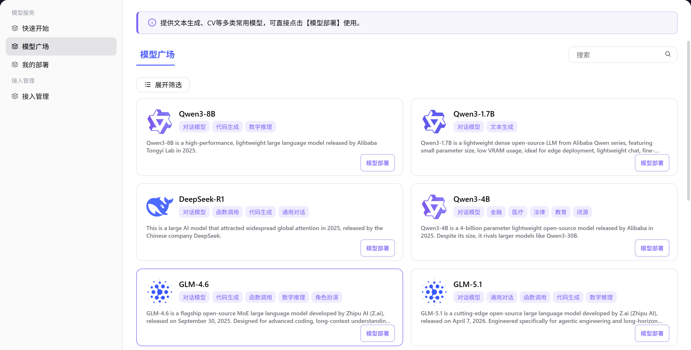

# 模型广场

## 前言

| 项目   | 内容                                                                                       |
| ---- | ---------------------------------------------------------------------------------------- |
| 适用角色 | 普通用户 |
| 导航路径 | 模型服务 > 模型广场                                                                              |
| 功能定位 | 模型浏览与发现门户，集中展示平台提供的各类预置模型资源，用户可通过模型类型、标签筛选或关键词搜索快速定位目标模型，查看详情并直接发起部署 |

## 页面结构

### 搜索区域

页面顶部提供模型类型和标签的多选筛选，支持搜索框快速定位模型。

### 操作按钮区

模型卡片提供 **"模型部署"** 按钮，用于直接进入部署流程。

### 数据列表说明

模型卡片列表展示模型名称、类型、标签、简介及操作入口。分页导航支持多页浏览。

### 页面截图

## 操作步骤

### 浏览与查看模型详情

1. 进入平台首页，点击左侧导航栏的 **"模型服务 > 模型广场"** 菜单，进入模型广场页面。
2. 筛选目标模型：
   - 通过左侧筛选栏，按 **模型类型**（对话模型、多模态、图片模型等）、**标签**（大语言模型、代码生成、向量与检索等）筛选；
   - 或在搜索框输入模型名称快速定位。
3. 点击目标模型卡片，进入模型详情页，查看完整的模型介绍、核心特性、技术规格等信息。
4. 如需部署，点击 **"模型部署"** 按钮，按指引完成部署流程。

#### 参数说明

| 字段名称 | 字段类型 | 示例 | 说明 |
|----------|----------|------|------|
| 模型类型 | 多选筛选 | `对话模型` / `图片模型` / `嵌入模型` | 按模型功能分类筛选 |
| 标签 | 多选筛选 | `大语言模型` / `代码生成` / `向量与检索` | 按模型能力和应用场景筛选 |
| 搜索框 | 文本 | `Qwen3-8B` | 输入模型名称或关键词快速定位 |

## 其他操作

| 操作名称 | 操作步骤 |
|----------|----------|
| 收起 / 展开筛选 | 点击「收起筛选」/「展开筛选」按钮 → 调整页面布局，专注浏览模型列表 |
| 模型部署 | 在模型卡片或详情页，点击 **"模型部署"** 按钮 → 进入部署流程，按指引完成配置 |

## 注意事项

- 模型广场中的模型为平台预置资源，浏览无需额外权限。
- 部署模型前请确保已完成云平台账号接入，详见「接入管理」模块。
- 部署将产生算力费用，建议提前确认账户余额充足。
- 模型部署完成后可在「我的部署」中管理和监控运行状态。