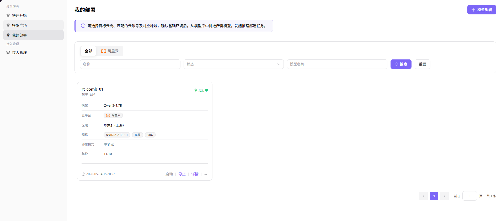

# 我的部署

## 前言

| 项目   | 内容                                    |
| ---- | ------------------------------------- |
| 适用角色 | 普通用户 |
| 导航路径 | 模型服务 > 我的部署                            |
| 功能定位 | 提供模型部署管理、状态查看和 API 调用功能             |

## 页面结构

### 搜索区域

页面顶部提供筛选工具栏，支持按云平台、部署名称、状态、模型名称进行筛选搜索，以及 **"搜索"** 和 **"重置"** 按钮。

### 操作按钮区

页面右上角提供 **"模型部署"** 按钮，用于创建新的模型部署任务。

### 数据列表说明

数据表格展示部署列表，包含部署名称、模型、状态、云平台、创建时间等信息。分页控制支持翻页和跳转至指定页。

### 页面截图

## 操作步骤

### 部署模型

1. 进入平台首页，点击左侧导航栏的 **"模型服务 > 我的部署"** 菜单，进入我的部署页面。
2. 点击页面右上角的 **"模型部署"** 按钮，进入部署流程。
3. 配置部署基础信息（Step 1）：
   - 选择目标 **模型**（如 `Qwen3-1.7B`）；
   - 选择 **部署模式**（单节点模式 / 高可用模式）；
   - 选择 **云平台**、**云账号**、**地域**；
   - 填写部署 **名称**（如 `rt_comb_01`），可补充描述信息。
4. 配置部署配置信息（Step 2）：
   - 选择运行 **框架** 及 **版本**；
   - 选择实例 **规格**（如 `ecs.gn7i-c16g1.4xlarge`，含 GPU/CPU/ 内存配置）；
   - 确认预估费用，点击「发起部署」。
5. 部署完成后，可在「我的部署」列表中查看状态，状态为「运行中」时即可使用。

#### 参数说明

| 字段名称 | 字段类型 | 示例 | 说明 |
|----------|----------|------|------|
| 模型 | 选择框 | `Qwen3-1.7B` | 必填，选择需要部署的目标模型 |
| 部署模式 | 单选 | `单节点模式` | 必填，选择单实例低成本模式或高可用模式 |
| 云平台 | 选择框 | `阿里云` | 必填，选择部署的目标云平台 |
| 云账号 | 选择框 | `aliyun-test` | 必填，选择已接入的云账号 |
| 地域 | 选择框 | `华东2（上海）` | 必填，选择部署的目标地域 |
| 名称 | 文本 | `rt_comb_01` | 必填，自定义部署任务名称 |
| 框架 | 选择框 | `VLLM-Qwen3-1.7B` | 必填，选择模型的运行框架 |
| 规格 | 选择框 | `ecs.gn7i-c16g1.4xlarge` | 必填，选择实例配置（含 GPU/CPU/ 内存） |

## 其他操作

| 操作名称        | 操作步骤                                                               |
| ----------- | ------------------------------------------------------------------ |
| 启动 / 停止部署   | 在部署卡片上，点击 **"启动"** / **"停止"** 按钮，控制实例运行状态                          |
| 查看部署详情      | 点击部署卡片的 **"详情"** 按钮 → 查看基本信息、API 调用、监控信息、事件记录                      |
| 查看 API 调用信息 | 在详情页切换至「API 调用」标签，可查看请求 URL、请求方法、请求头、请求参数                          |
| 发布模型        | 点击部署卡片的 **"..."** 按钮 → 选择「发布」→ 选择私有区/公有区 → 完成发布配置 → 提交             |
| 删除部署        | 点击部署卡片的 **"..."** 按钮 → 选择「删除」→ 确认（**删除操作不可逆，请谨慎操作**）               |

## 注意事项

- **删除操作不可逆**：删除部署任务后，数据将无法恢复，请在删除前确认无遗留业务依赖。
- **部署状态监控**：部署任务提交后，建议定期查看状态，确保实例正常启动后再进行 API 调用。
- **费用预估**：发起部署前，请确认预估费用在预算范围内，避免因资源费用超出预期导致损失。
- **云账号配置**：确保已配置的云账号（AK/SK）有效且具有足够权限，否则部署可能失败。
- **发布区域选择**：发布至公有区后，模型将对所有租户可见且可调用，如涉及敏感业务请谨慎选择。
- **规格选择**：根据业务负载选择合适的实例规格，高规格实例费用更高但性能更强。