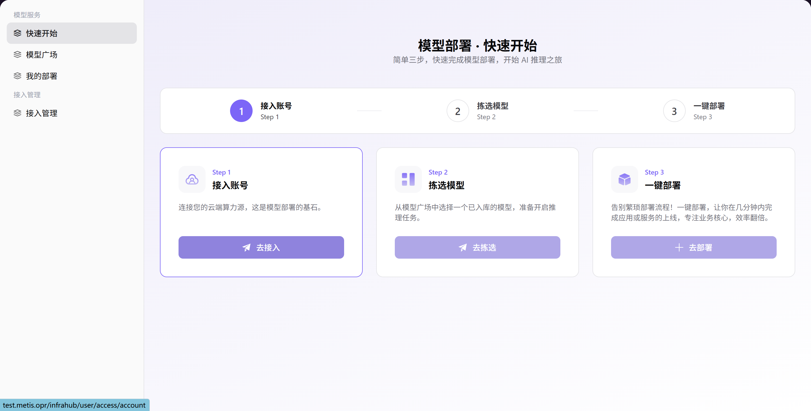

# 快速开始

## 前言

| 项目   | 内容                                 |
| ---- | ---------------------------------- |
| 适用角色 | 普通用户 |
| 导航路径 | 模型服务 > 快速开始                       |
| 功能定位 | 引导用户按步骤完成模型部署的快速开始页面           |

## 页面结构

### 搜索区域

无（该页面为引导页面，采用步骤卡片式布局，无需搜索功能）。

### 操作按钮区

每个步骤卡片提供对应的操作按钮：「**继续接入**」、「**继续拣选**」、「**去部署**」。

### 数据列表说明

页面采用引导式布局，分为三个并列步骤卡片：

- **Step 1：接入账号** — 连接云端算力源，这是模型部署的基石
- **Step 2：拣选模型** — 从模型广场中选择一个已入库的模型，准备开启推理任务
- **Step 3：一键部署** — 告别繁琐部署流程，一键部署让模型快速上线

每个步骤卡片包含标题、描述和操作按钮，用户点击按钮即可跳转至对应功能页面完成配置。

### 页面截图

## 操作步骤

按照页面引导，依次完成以下 3 个步骤：

**Step 1：接入账号**
- 点击「**继续接入**」按钮，添加并配置云平台账号（AK/SK 凭证），连接云端算力资源，为模型部署提供基础算力支持。

**Step 2：拣选模型**
- 点击「**继续拣选**」按钮，进入模型广场，浏览并选择已入库的目标模型，为后续推理任务做准备。

**Step 3：一键部署**
- 点击「**去部署**」按钮，选择已接入的算力资源，确认目标模型与部署规格，提交后即可快速完成模型部署，开启 AI 推理之旅。

## 注意事项

- 部署前请确保已完成云平台账号的接入，否则无法进行后续的拣选和部署操作
- 一键部署前请确认所选模型的适用场景及规格要求，确保与业务需求匹配
- 部署过程通常需要数分钟，完成后可在"我的部署"页面查看部署状态