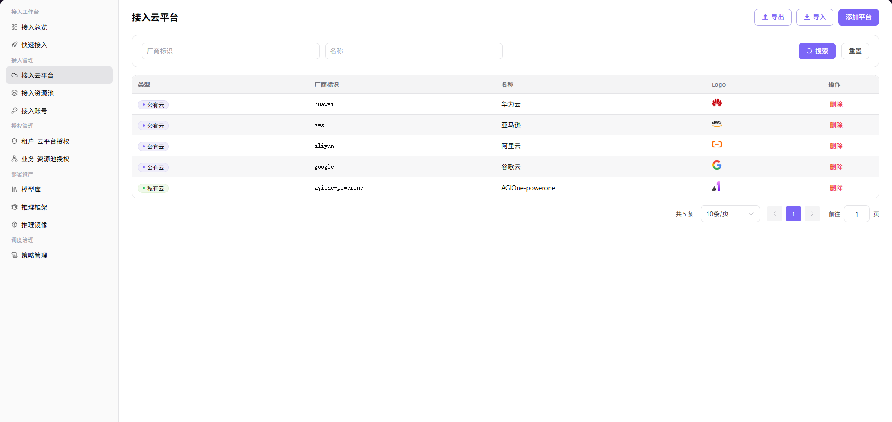

# 接入云平台

## 前言

| 项目 | 内容 |
|------|------|
| 适用角色 | 运营方 |
| 导航路径 | 接入管理 > 接入云平台 |
| 功能定位 | 维护平台支持的云平台列表（公有云 / 私有云），为后续接入资源池、接入账号、模型发布等流程提供基础数据支撑 |

## 页面结构

### 搜索区域

页面顶部支持按厂商标识、名称进行多维度筛选。

### 操作按钮区

- 页面右上角提供 **"添加平台"** 按钮，用于新增云平台。
- 顶部提供 **"导出"** / **"导入"** 按钮，批量管理云平台配置。
- 每个云平台行提供 **"删除"** 操作。

### 数据列表说明

页面以表格形式展示所有云平台，列头含 类型 / 厂商标识 / 名称 / Logo / 操作，默认展示 5 条云平台记录：
- **公有云**：华为云（huawei / 华为云）、aws 亚马逊（aws / 亚马逊）、阿里云（aliyun / 阿里云）、谷歌云（google / 谷歌云）
- **私有云**：AGIOne-powerone（agione-powerone / AGIOne-powerone）

## 操作步骤

### 添加平台

1. 进入平台首页，点击左侧导航栏的 **"接入管理 > 接入云平台"** 菜单，进入云平台管理页面。
2. 点击页面右上角的 **"添加平台"** 按钮，弹出「添加平台」窗口。

3. 选择 **"云平台类型"**（公有云 / 私有云，二选一 Tab）。
4. 配置云平台信息：
   - 填写 / 选择 **"厂商标识"**，用于在系统中唯一标识该云平台（公有云为下拉选择，私有云为文本输入）；
   - **"显示名称"**（标注"多语言"）：用于设置云平台在列表、详情和选择控件中的显示名称。点击 **"English"** / **"中文简体"** 标签切换语言 Tab，**"将在 English 语言环境下显示"** / **"将在中文简体语言环境下显示"** 的提示，分别在对应 Tab 下填写英文与中文简体环境下的名称；
   - （**仅私有云**）填写 **"链接地址"**，用于访问该私有云平台；
   - 上传 **"Logo"** 图标。
5. 确认所有信息配置无误后，点击 **"确定"** 按钮完成添加；如需放弃，点击 **"取消"**。

#### 参数说明

| 字段名称 | 字段类型 | 示例 | 说明 |
|----------|----------|------|------|
| 云平台类型 | 二选一 Tab | `公有云` / `私有云` | 必填，标识云平台的类型 |
| 厂商标识 | 下拉选择（公有云）/ 文本（私有云） | `aliyun` / `agione-powerone` | 必填，云平台的唯一标识 |
| 显示名称 | 多语言文本 | English: `aliyun` / 中文简体: `阿里云` | 必填，分别在"English"和"中文简体"Tab 下配置显示名称 |
| 链接地址 | URL | `http://test.metis.opr/infrahub/op/access/platform` | **仅私有云**必填，私有云平台的访问地址 |
| Logo | 图片 | `阿里云 / 华为云 / AGIOne-powerone 图标` | 选填，用于展示的云平台图标 |

## 其他操作

| 操作名称 | 操作步骤 |
|----------|----------|
| 删除平台 | 点击目标云平台的 **"删除"** 按钮 → 删除操作不可逆，请谨慎操作 |
| 导出 / 导入配置 | 点击页面右上角的 **"导出"** / **"导入"** 按钮 → 批量管理云平台配置 |

## 注意事项

- **删除操作不可逆**，请谨慎操作。
- 私有云与公有云的关键差异：私有云需额外配置"链接地址"，用于访问该私有云平台。
- 公有云场景下"厂商标识"为下拉选择（含预置的 huawei / aws / aliyun / google / baidu 等厂商）；私有云场景下为文本输入。
- 多语言字段需同时维护英文与中文两个版本，切换语言 Tab 可维护另一个语言版本。
