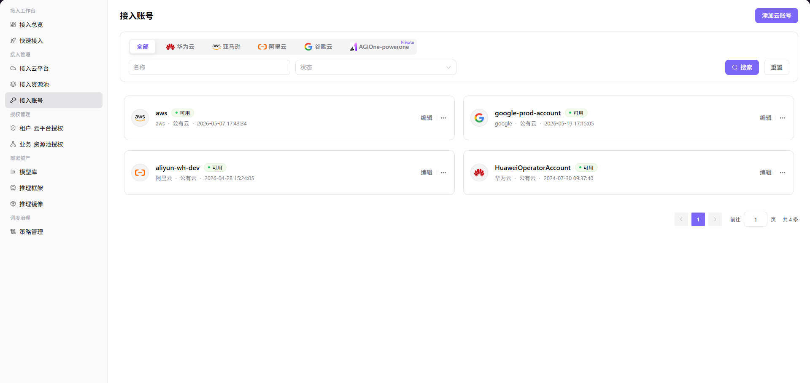
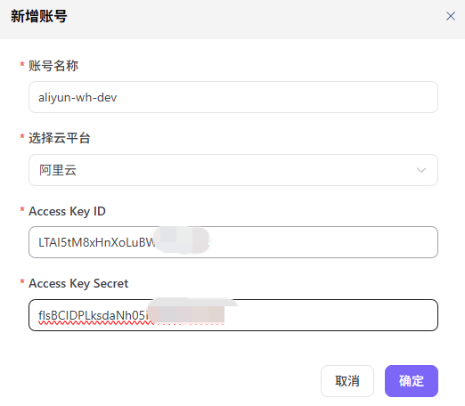

# 接入账号

## 前言

| 项目 | 内容 |
|------|------|
| 适用角色 | 运营方 |
| 导航路径 | 接入管理 > 接入账号 |
| 功能定位 | 维护各云平台下的云账号凭证（Access Key），为后续模型部署、算力配置等流程提供身份认证支撑 |

## 页面结构

### 云平台 Tabs

页面顶部提供云平台 Tabs（**全部** / 华为云 / aws 亚马逊 / 阿里云 / 谷歌云 / AGIOne-powerone[Private]）。

### 搜索区域

页面顶部提供搜索栏（**名称** / **状态**）+ **"搜索"** / **"重置"** 按钮。

### 数据列表说明

默认展示所有云账号卡片网格（每行 2 个），每张卡片含 账号名称 / 云平台 logo + 名称 / 公有云私有云 / 创建时间 / 状态（"可用"等），如 aws（公有云，2026-05-07 17:43:34）、google-prod-account（公有云，2026-05-19 17:15:05）、aliyun-wh-dev（公有云，2026-04-28 15:24:05）、HuaweiOperatorAccount（公有云，2024-07-30 09:37:40）等。

### 操作按钮区

- 页面右上角提供 **"添加云账号"** 按钮，用于新增云账号。
- 每个云账号卡片提供 **"编辑"** 按钮（直接编辑）。
- 每个云账号卡片右上角提供 **"..."**（更多）按钮，菜单内含 **"删除"** 操作。

## 操作步骤

### 添加云账号

1. 进入平台首页，点击左侧导航栏的 **"接入管理 > 接入账号"** 菜单，进入接入账号管理页面。
2. 点击页面右上角的 **"添加云账号"** 按钮，弹出「新增账号」窗口。

3. 配置账号信息：
   - 填写 **"账号名称"**，用于标识该云账号；
   - 从下拉列表中选择 **"选择云平台"**（如阿里云、亚马逊、华为云等）；
   - 输入目标云平台的 **"Access Key ID"**；
   - 输入目标云平台的 **"Access Key Secret"**。
5. 确认所有信息配置无误后，点击 **"确定"** 按钮完成添加；如需放弃，点击 **"取消"**。

#### 参数说明

| 字段名称 | 字段类型 | 示例 | 说明 |
|----------|----------|------|------|
| 账号名称 | 文本 | `aliyun-wh-dev` | 必填，自定义账号标识 |
| 选择云平台 | 下拉选择 | `阿里云` | 必填，选择目标云平台 |
| Access Key ID | 文本 | `LTAI5tM8xHnXoLuBW...` | 必填，云平台访问凭证 ID |
| Access Key Secret | 密码 | `flsBCIDPLksdaNh05J...` | 必填，云平台访问凭证密钥 |

## 其他操作

| 操作名称 | 操作步骤 |
|----------|----------|
| 编辑账号 | 点击目标账号卡片的 **"编辑"** 按钮 → 修改账号信息 → 点击 **"确定"** |
| 删除账号 | 点击目标账号卡片右上角的 **"..."**（更多）按钮 → 选择 **"删除"** → 删除后数据将无法恢复，请谨慎操作 |
