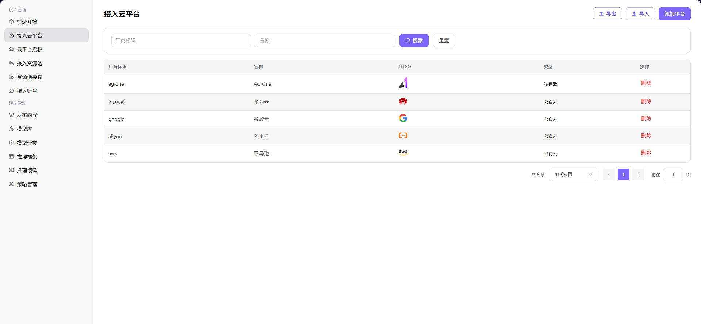

# 接入云平台

## 前言

| 项目   | 内容                           |
| ---- | ---------------------------- |
| 适用角色 | Operator                          |
| 导航路径 | 接入管理 > 接入云平台                 |
| 功能定位 | 管理公有云和私有云厂商平台信息，为后续云资源接入奠定基础 |

## 页面结构

### 搜索区域

页面顶部提供搜索与筛选功能，支持按厂商标识和名称快速定位目标云平台。

### 操作按钮区

页面右上角提供 **"导出"**、**"导入"**、**"添加平台"** 按钮，用于批量管理配置和添加平台。

### 数据列表说明

数据表格区展示已接入的云平台列表，包含平台标识、名称、Logo、类型和操作列。

### 页面截图

## 操作步骤

### 添加平台

1. 进入平台首页，点击左侧导航栏的 **"接入管理 > 接入云平台"** 菜单，进入云平台管理页面。
2. 点击页面右上角的 **"添加平台"** 按钮，弹出「添加平台」窗口。
3. 配置云平台信息：
   - 选择 **云平台类型**（公有云 / 私有云）；
   - 填写 / 选择 **厂商标识**；
   - 配置 **多语言显示名称**（分别填写英文与中文简体环境下的名称）；
   - （私有云需填写）**链接地址**；
   - 上传 **Logo** 图标。
4. 确认所有信息配置无误后，点击 **"确定"** 按钮完成添加。

#### 参数说明

| 字段名称 | 字段类型 | 示例 | 说明 |
|----------|----------|------|------|
| 云平台类型 | 单选 | `公有云` / `私有云` | 必填，标识云平台的类型 |
| 厂商标识 | 文本 / 下拉选择 | `aliyun` / `agione-powerone` | 必填，云平台的唯一标识 |
| 显示名称（多语言） | 文本 | `aliyun` / `阿里云` | 必填，需分别配置英文与中文简体环境下的显示名称 |
| 链接地址 | 文本 | `http://test.metis.opr` | 私有云必填，私有云平台的访问地址 |
| Logo | 图片 | `阿里云图标` | 选填，用于展示的云平台图标 |

## 其他操作

| 操作名称      | 操作步骤                                        |
| --------- | ------------------------------------------- |
| 删除平台      | 点击目标云平台的 **"删除"** 按钮 → **删除操作不可逆**，请谨慎操作    |
| 导出 / 导入配置 | 点击页面右上角的 **"导出"** / **"导入"** 按钮 → 批量管理云平台配置 |

## 注意事项

- 添加云平台前请确认平台类型（公有云/私有云）选择正确
- 厂商标识具有唯一性，填写后不可修改
- 私有云平台的链接地址用于系统访问该平台，请确保地址可访问
- Logo 图片建议使用透明背景的 PNG 格式，以获得最佳展示效果
- **删除平台操作不可逆**，删除后该平台下的所有关联资源将无法正常使用，请谨慎操作