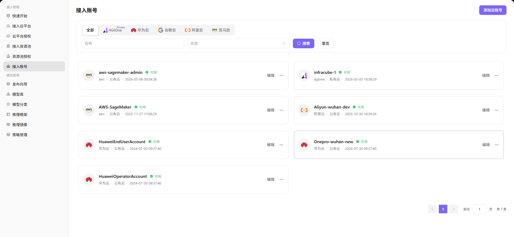

# 接入账号

## 前言

| 项目   | 内容                                     |
| ---- | -------------------------------------- |
| 适用角色 | Operator                                |
| 导航路径 | 接入管理 > 接入账号                            |
| 功能定位 | 管理云平台访问凭证（AK/SK），系统通过账号拉取并管理云端资源 |

## 页面结构

### 搜索区域

页面顶部提供云平台过滤标签（全部、华为云、亚马逊、阿里云、谷歌云、AGIOne）、账号名称搜索框、状态下拉选择，以及 **"不可用"** 和 **"可用"** 操作按钮。

### 操作按钮区

页面右上角提供 **"添加云账号"** 按钮，用于添加新账号。

### 数据列表说明

账号卡片列表以卡片形式展示已接入的云账号，显示账号名称、云平台、状态、类型和创建时间。

### 页面截图

## 操作步骤

### 添加云账号

1. 进入平台首页，点击左侧导航栏的 **"接入管理 > 接入账号"** 菜单，进入接入账号管理页面。
2. 点击页面右上角的 **"添加云账号"** 按钮，弹出「新增账号」窗口。
3. 配置账号信息：
   - 填写 **账号名称**，用于标识该云账号；
   - 从下拉列表中选择 **云平台**（如阿里云、亚马逊、华为云等）；
   - 输入目标云平台的 **Access Key ID**；
   - 输入目标云平台的 **Access Key Secret**。
4. 确认所有信息配置无误后，点击 **"确定"** 按钮完成添加。

#### 参数说明

| 字段名称 | 字段类型 | 示例 | 说明 |
|----------|----------|------|------|
| 账号名称 | 文本 | `aliyun-wh-dev` | 必填，自定义账号标识 |
| 选择云平台 | 下拉选择 | `阿里云` | 必填，选择目标云平台 |
| Access Key ID | 文本 | `your-access-key-id` | 必填，云平台访问凭证 ID |
| Access Key Secret | 文本 | `your-access-key-secret` | 必填，云平台访问凭证密钥 |

## 其他操作

| 操作名称 | 操作步骤 |
|----------|----------|
| 编辑账号 | 点击目标账号卡片右上角的 **"..."**（更多）按钮 → 选择 **"编辑"** → 修改账号信息 → 点击 **"确定"** |
| 删除账号 | 点击目标账号卡片右上角的 **"..."**（更多）按钮 → 选择 **"删除"** → 确认操作（**删除后数据将无法恢复，请谨慎操作**） |

## 注意事项

- 添加云账号时，请确保填写的 Access Key ID 和 Access Key Secret 与云平台控制台一致，否则将导致资源拉取失败。
- **删除账号操作不可逆**，删除后数据将无法恢复，请谨慎操作。
- 建议定期检查账号状态，确保账号凭证有效且可正常访问云平台资源。
