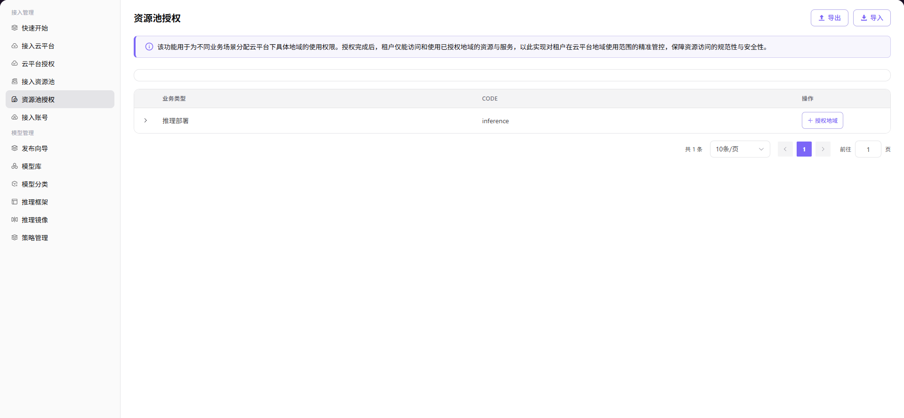

# 资源池授权

## 前言

| 项目   | 内容                                               |
| ---- | ------------------------------------------------ |
| 适用角色 | Operator                                          |
| 导航路径 | 接入管理 > 资源池授权                                    |
| 功能定位 | 将云平台地域的使用权限分配给不同的业务类型，实现租户对云平台区域访问范围的精细化控制 |

## 页面结构

### 搜索区域

页面顶部提供业务类型筛选标签和搜索功能，支持快速定位目标业务类型。

### 操作按钮区

页面右上角提供 **"导出"** 和 **"导入"** 按钮，用于批量管理授权配置。

### 数据列表说明

业务类型卡片列表展示已配置的业务类型（如 `INFERENCE_JOB` 推理部署），显示各类型的云平台授权统计。

### 页面截图

## 操作步骤

### 授权地域

1. 进入平台首页，点击左侧导航栏的 **"接入管理 > 资源池授权"** 菜单，进入资源池授权页面。
2. 找到目标业务类型（如 `"推理部署"`），点击其右侧的 **"授权地域"** 按钮，弹出「授权地域」窗口。
3. 在窗口中，勾选需要授权的云平台地域（如亚马逊欧洲（法兰克福）、阿里云华东 2（上海）等）。
4. 确认选择无误后，点击 **"确定"** 按钮，完成地域授权。

#### 参数说明

| 字段名称 | 字段类型 | 示例 | 说明 |
|----------|----------|------|------|
| 业务类型 | 文本 | `推理部署` | 必填，标识需要进行资源池授权的业务场景 |
| 云平台 | 多选框 | `阿里云` / `亚马逊` | 必填，选择需要授权的云平台 |
| 地域 | 多选框 | `华东2（上海）` / `欧洲（法兰克福）` | 必填，选择需要授权的具体地域 |

## 其他操作

| 操作名称 | 操作步骤 |
|----------|----------|
| 导出 / 导入配置 | 点击页面右上角的 **"导出"** / **"导入"** 按钮 → 批量管理资源池授权配置 |
| 查看授权统计 | 在业务类型卡片下，查看各云平台已授权的地域数量统计 |

## 注意事项

- 资源池授权完成后，租户只能访问和使用已授权区域内的资源和服务，请谨慎配置。
- 导出 / 导入功能用于批量管理资源池授权配置，请确保导入文件格式正确，避免覆盖现有数据。