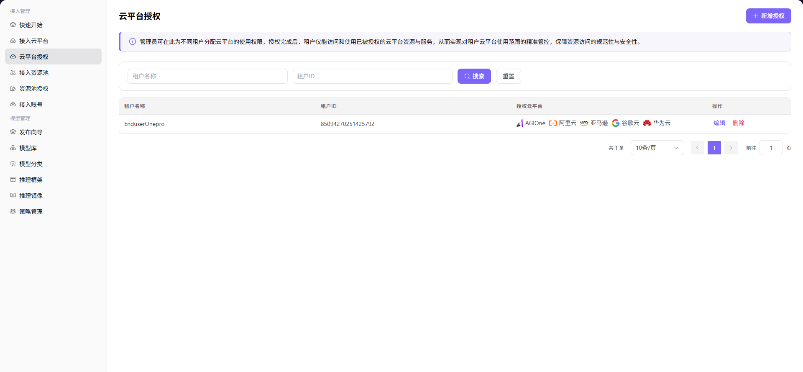

# 云平台授权

## 前言

| 项目   | 内容                                |
| ---- | --------------------------------- |
| 适用角色 | Operator                               |
| 导航路径 | 接入管理 > 云平台授权                      |
| 功能定位 | 将云平台使用权限分配给不同租户，实现租户对云平台使用范围的精准管控 |

## 页面结构

### 搜索区域

页面顶部提供租户名称和租户 ID筛选输入框及 **"搜索"** 和 **"重置** 操作按钮。

### 操作按钮区

页面右上角提供 **"新增授权"** 按钮。提示区显示当前功能说明文字。

### 数据列表说明

数据表格区展示已授权的租户列表，包含租户名称、租户 ID、已授权云平台和操作列。

### 页面截图

## 操作步骤

### 新增授权

1. 进入平台首页，点击 **"接入管理 > 云平台授权"** 菜单，进入云平台授权管理页面。
2. 点击页面右上角的 **"新增授权"** 按钮，弹出「新增授权」窗口。
3. 在「选择云平台」下拉列表中，勾选需要授权的云平台（如阿里云、华为云、AGIONE）。
4. 选择授权范围：
   - 若需为指定租户授权，选择 **单个租户授权**，并在「选择租户」输入框中填写目标租户名称；
   - 若需为所有租户授权，选择 **授权所有租户**。
5. 确认所有配置无误后，点击 **"确定"** 按钮完成授权。

#### 参数说明

| 字段名称  | 字段类型 | 示例                      | 说明                 |
| ----- | ---- | ----------------------- | ------------------ |
| 选择云平台 | 多选下拉 | `阿里云`、`AGIOne-powerone` | 必填，支持同时选择多个云平台     |
| 授权范围  | 单选   | 单个租户授权 / 授权所有租户         | 必填，决定授权对象          |
| 选择租户  | 文本   | `dushuangyan01`         | 单个租户授权时必填，填写目标租户名称 |

## 其他操作

| 操作名称 | 操作步骤                                                      |
| ---- | --------------------------------------------------------- |
| 编辑授权 | 在列表中找到目标租户行，点击 **"编辑"** 按钮 → 修改云平台勾选（租户不可编辑）→ 点击 **"确定"** |
| 删除授权 | 在列表中找到目标租户行，点击 **"删除"** 按钮 → **删除操作不可逆，请谨慎操作**            |

## 注意事项

- 授权前请确保目标租户已存在，且云平台已正确接入系统
- 授权范围选择"授权所有租户"时，新入驻的租户将自动获得该云平台的使用权限
- **删除授权操作不可逆**，删除后相关租户将无法再访问该云平台，请谨慎操作
- 云平台授权是租户使用云资源的前置条件，未授权的租户无法访问任何云平台资源