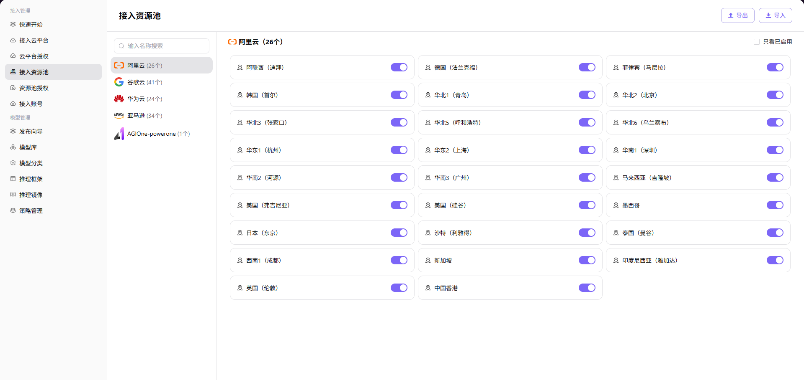

# 接入资源池

## 前言

| 项目   | 内容                                               |
| ---- | ------------------------------------------------ |
| 适用角色 | Operator                                          |
| 导航路径 | 接入管理 > 接入资源池                                    |
| 功能定位 | 配置云厂商地域的启用/禁用状态，以及编辑地域的显示名称，实现多云资源的统一管理 |

## 页面结构

### 搜索区域

顶部工具栏提供 **"只看已启用"** 筛选复选框，按启用状态筛选地域。

### 操作按钮区

页面右上角提供 **"导出"** 和 **"导入"** 按钮，用于批量管理资源池配置。

### 数据列表说明

页面采用左侧云厂商列表 + 右侧地域卡片的双栏布局：

- **左侧云厂商选择栏**：展示已接入的云平台（google、huawei、aws、aliyun），显示各平台的地域数量统计
- **右侧地域管理区**：以卡片形式展示选中云平台下的所有地域，包含地域名称、启用状态开关、编辑操作入口

### 页面截图

## 操作步骤

### 启用 / 禁用资源池地域

1. 进入平台首页，点击左侧导航栏的 **"接入管理 > 接入资源池"** 菜单，进入资源池管理页面。
2. 在左侧选择目标云厂商（如阿里云、华为云等）。
3. 在右侧地域列表中，找到需要启用 / 禁用的地域，点击地域卡片右侧的开关按钮：
   - 开关为开启状态时，表示该地域已启用；
   - 点击开关即可切换地域的启用 / 禁用状态。

### 编辑地域显示名称

1. 进入平台首页，点击左侧导航栏的 **"接入管理 > 接入资源池"** 菜单，进入资源池管理页面。
2. 在左侧选择目标云厂商，找到需要编辑的地域。
3. 点击地域卡片上的编辑图标，弹出「编辑名称」窗口。
4. 配置多语言显示名称：
   - 分别填写 **English** 与 **中文简体** 环境下的显示名称；
   - 例如英文环境填写 `China (Shanghai)`，中文环境填写 `华东2（上海）`。
5. 确认配置无误后，点击 **"确定"** 按钮完成修改。

## 其他操作

| 操作名称 | 操作步骤 |
|----------|----------|
| 只看已启用 | 勾选页面右上角的 **"只看已启用"** 复选框 → 仅显示已启用的地域 |
| 导出 / 导入配置 | 点击页面右上角的 **"导出"** / **"导入"** 按钮 → 批量管理资源池配置 |

## 注意事项

- 地域开关启用后，对应地域的资源池将被业务系统正常使用，请谨慎操作。
- 编辑地域显示名称时，需要分别配置英文与中文简体环境下的名称，以确保多语言界面均能正确展示。
- 导出 / 导入功能用于批量管理资源池配置，请确保导入文件格式正确，避免覆盖现有数据。