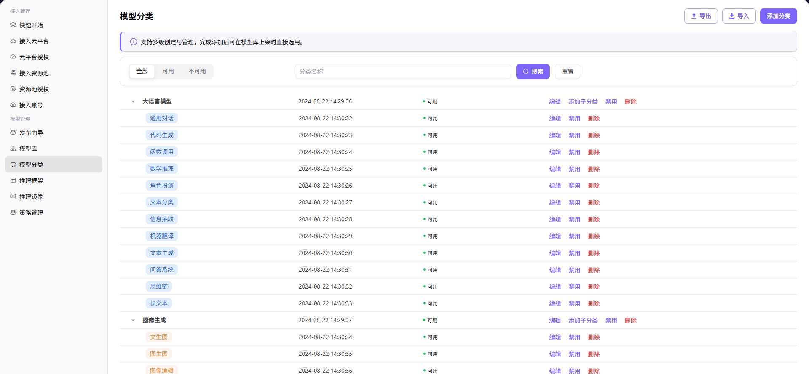

# 模型分类

## 前言

| 项目   | 内容                                               |
| ---- | ------------------------------------------------ |
| 适用角色 | Operator                                          |
| 导航路径 | 模型管理 > 模型分类                                      |
| 功能定位 | 管理模型的分类体系，支持多层级分类创建与管理，可在添加模型时直接选择 |

## 页面结构

### 搜索区域

页面顶部支持按分类名称搜索，状态筛选支持 All（全部）、Usable（可用）、Unusable（不可用）。

### 操作按钮区

页面右上角提供 **"导出"**、**"导入"和 "添加分类"**（添加分类）按钮，用于批量配置管理和分类创建。

### 数据列表说明

分类树以树形结构展示所有分类，支持展开/折叠一级和二级分类。

### 页面截图

## 操作步骤

### 添加分类

1. 进入平台首页，点击左侧导航栏的 **"模型管理 > 模型分类"** 菜单，进入模型分类管理页面。
2. 点击页面右上角的 **"添加分类"** 按钮，弹出「添加分类」窗口。
3. 配置分类信息：
   - 填写 **编码**（如 `image generation`）；
   - 配置 **多语言显示名称**（分别填写英文与中文简体环境下的名称）；
   - 配置 **颜色标识**（支持快速配置或自定义配置）。
4. 点击 **"确定"** 完成添加。

#### 参数说明

| 字段名称 | 字段类型 | 示例 | 说明 |
|----------|----------|------|------|
| 编码 | 文本 | `image generation` / `text-to-image` | 必填，分类唯一标识 |
| 显示名称（多语言） | 文本 | `Image Generation` / `文生图` | 必填，需分别配置英文与中文简体环境下的显示名称 |
| 颜色配置 | 单选 | `快速配置` / `自定义配置` | 选填，用于设置分类标签的展示颜色 |

## 其他操作

| 操作名称      | 操作步骤                                                     |
| --------- | -------------------------------------------------------- |
| 编辑分类      | 点击目标分类的 **"编辑"** 按钮 → 修改编码、多语言显示名称、颜色配置等信息 → 点击 **"确定"** |
| 添加子分类     | 点击目标一级分类的 **"添加子分类"** 按钮 → 填写编码、多语言显示名称等信息 → 点击 **"确定"** |
| 启用 / 禁用   | 点击目标分类的 **"启用"** / **"禁用"** 按钮 → 确认状态变更                  |
| 删除分类      | 点击目标分类的 **"删除"** 按钮 → **删除操作不可逆，请谨慎操作**                  |
| 导出 / 导入配置 | 点击页面右上角的 **"导出"** / **"导入"** 按钮 → 批量管理模型分类配置             |

## 注意事项

- 删除分类操作不可逆，请谨慎操作
- 添加子分类时，其编码需要在父分类下唯一
- 禁用分类后，该分类下的模型将无法使用该分类进行筛选