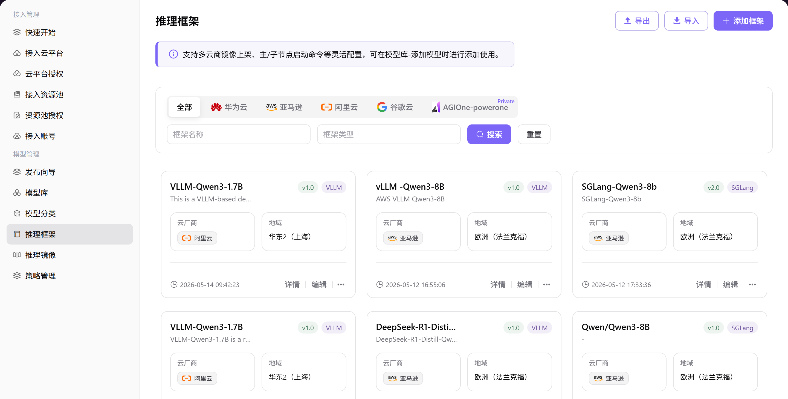

# 推理框架

## 前言

| 项目   | 内容                                                   |
| ---- | ---------------------------------------------------- |
| 适用角色 | Operator                                          |
| 导航路径 | 模型管理 > 推理框架                                          |
| 功能定位 | 管理模型的推理运行环境配置，定义框架类型、版本、镜像地址、端口及启动命令，为模型部署提供基础运行环境支持 |

## 页面结构

### 搜索区域

页面顶部提供云平台筛选（全部/AGIONE/ 华为云 / 谷歌云 / 阿里云 ）、框架名称搜索框、框架类型搜索框，以及 **"搜索"** 和 **"重置"** 按钮。

### 操作按钮区

页面右上角提供 **"导出"**、**"导入"** 和 **"添加框架"** 按钮，用于批量配置管理和框架创建。

### 数据列表说明

数据表格展示框架列表，包含框架名称、描述、版本、框架类型、云平台、地域、创建时间、操作列（详情 / 编辑 / ...）。

### 页面截图

## 操作步骤

### 添加推理框架

1. 进入平台首页，点击左侧导航栏的 **"模型管理 > 推理框架"** 菜单，进入推理框架管理页面。
2. 点击页面右上角的 **"添加框架"** 按钮，弹出「添加框架」窗口。
3. 配置框架基础信息：
   - 选择 **云平台**（如阿里云、华为 等）；
   - 选择 **云账号**；
   - 选择 **地域**；
   - 填写 **框架类型**（如 `VLLM`）；
   - 填写 **框架名称**（如 `VLLM-Qwen3-1.7B`）；
   - 填写 **框架描述**；
   - 填写 **框架版本**（如 `v1.0`）；
   - （可选）填写 **默认API后缀**。
1. 配置部署相关信息：
   - 填写 **镜像**；
   - 填写 **端口**（如 `8000`）；
   - 填写 **主节点启动命令**；
   - 填写 **子节点启动命令**；
   - （可选）配置 **环境变量** 与 **拓展参数**。
1. 确认所有信息配置无误后，点击 **"确定"** 按钮完成添加。

#### 参数说明

| 字段名称    | 字段类型 | 示例                                                                              | 说明                |
| ------- | ---- | ------------------------------------------------------------------------------- | ----------------- |
| 云平台     | 单选   | `aliyun`                                                                        | 必填，支持多云商选择        |
| 云账号     | 下拉选择 | `aliyun-wh-dev`                                                                 | 必填，选择已接入的云账号      |
| 地域      | 下拉选择 | `cn-shanghai`                                                                   | 必填，选择框架部署的地域      |
| 框架类型    | 文本   | `VLLM`                                                                          | 必填，标识推理框架的类型      |
| 框架名称    | 文本   | `VLLM-Qwen3-1.7B`                                                               | 必填，自定义框架标识        |
| 框架描述    | 文本   | —                                                                               | 选填，用于说明框架用途与特性    |
| 框架版本    | 文本   | `v1.0`                                                                          | 必填，标识框架版本         |
| 默认API后缀 | 文本   | `/v1/chat/completions`                                                          | 选填，框架默认的 API 接口后缀 |
| 镜像      | 文本   | `eas-registry-vpc.cn-shanghai.cr.aliyuncs.com/pai-eas/vllm:v0.9.1-modelgallery` | 必填，框架使用的容器镜像地址    |
| 端口      | 数字   | `8000`                                                                          | 必填，服务监听端口         |
| 主节点启动命令 | 文本   | `vllm serve /model/Qwen3-1.7B ...`                                              | 必填，主节点启动时执行的命令    |
| 子节点启动命令 | 文本   | `vllm serve /model/Qwen3-1.7B ...`                                              | 必填，子节点启动时执行的命令    |
| 环境变量    | 键值对  | —                                                                               | 选填，配置框架运行所需的环境变量  |
| 拓展参数    | 文本   | —                                                                               | 选填，配置框架运行的额外参数    |

## 其他操作

| 操作名称      | 操作步骤                                                                        |
| --------- | --------------------------------------------------------------------------- |
| 编辑框架      | 点击目标框架的 **"编辑"** 按钮 → 修改框架类型、名称、描述等信息 → 点击 **"确定"**                         |
| 查看详情      | 点击目标框架的 **"详情"** 按钮 → 在「框架信息」和「版本信息」页签中查看基本信息、版本配置 → 点击左上角返回箭头退出            |
| 新增版本      | 点击目标框架的 **"..."**（更多）按钮 → 选择 **"新增版本"** → 填写版本号、镜像、端口、启动命令等信息 → 点击 **"确定"** |
| 卸载框架      | 点击目标框架的 **"..."**（更多）按钮 → 选择 **"卸载"** → 确认操作（**卸载后数据将无法恢复，请谨慎操作**）          |
| 导出 / 导入配置 | 点击页面右上角的 **"导出"** / **"导入"** 按钮 → 批量管理推理框架配置                                |

## 注意事项

- **删除操作不可逆**，请谨慎操作。
- 配置镜像地址时，确保镜像已正确推送到对应云平台的容器镜像仓库。
- 启动命令需根据实际模型和框架要求进行配置，错误的启动命令可能导致部署失败。
- 多云商场景下，请确保各云平台的账号权限足够（至少需要读取镜像仓库和调用 GPU 实例的权限）。