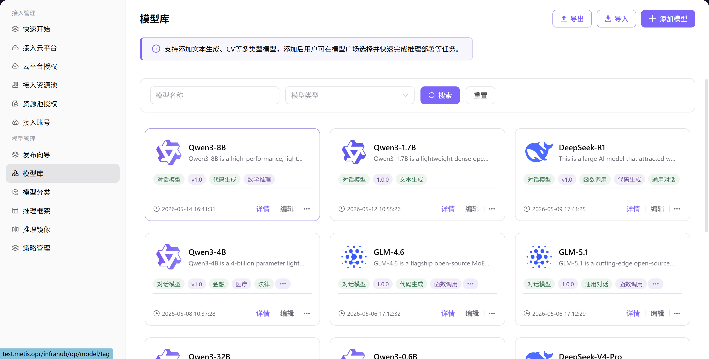

# 模型库

## 前言

| 项目   | 内容                                               |
| ---- | ------------------------------------------------ |
| 适用角色 | Operator                                          |
| 导航路径 | 模型管理 > 模型库                                       |
| 功能定位 | 管理所有已入库的 AI 模型，支持模型的添加、编辑、查看详情、删除等操作 |

## 页面结构

### 搜索区域

页面顶部支持按模型名称搜索、按模型类型筛选，以及 **"搜索"** 和 **"重置"** 按钮。

### 操作按钮区

页面右上角提供 **"添加模型"**、**"导出"**和 **"导入"**按钮，用于模型创建和批量配置管理。

### 数据列表说明

模型列表以卡片形式展示所有模型，显示模型名称、描述、类型、版本、标签、创建时间等信息。分页控制支持分页浏览，每页显示 10 条。

### 页面截图

## 操作步骤

### 添加模型

1. 进入平台首页，点击左侧导航栏的 **"模型管理 > 模型库"** 菜单，进入模型库页面。
2. 点击页面右上角的 **"添加模型"** 按钮，进入添加模型流程。
3. 在弹出的窗口中，填写 **模型信息配置** 表单：
   - 选择 **模型类型**（如对话模型、多模态、图片模型等）；
   - 填写 **模型名称**、**模型描述**、**模型标签**；
   - 上传 **模型图片**；
   - 填写 **版本号** 与 **版本描述**；
   - 点击 **"下一步"**。
4. 在编辑器中填写模型的详细介绍，包括 Introduction、Key Advantages、Use Cases 等内容，点击 **"下一步"**。
5. 在「模型录入配置」区域，点击 **"添加录入"**，配置模型存储信息：
   - 选择 **云平台**（如阿里云、华为云等）；
   - 选择 **云账号**；
   - 选择 **地域**；
   - 选择 **模型来源**（自有对象存储 / ModelScope / HuggingFace / 公共模型）；
   - 输入 **公共模型名称**；
   - 点击 **"保存"**。
6. 在「部署配置」区域，点击 **"添加配置"**，配置模型运行环境：
   - 选择关联的 **模型框架**；
   - 选择部署 **规格配置**（GPU 型号、数量、CPU、内存等）；
   - 点击 **"保存"**；
   - 点击 **"下一步"**。
7. 在「输出配置」区域，点击 **"添加配置"**，配置 API 接口信息：
   - 填写 **请求 URL**、**请求方法**；
   - 配置 **请求头**（如 Content-Type、Authorization）；
   - 配置 **请求参数**（如 max_tokens、messages）；
   - 查看并复制不同语言的 **代码样例**；
   - 点击 **"保存"**；
   - 点击 **"下一步"**。
8. 预览模型信息、介绍、部署及输出配置，确认无误后，点击 **"提交"** 完成模型添加。

#### 参数说明 - 模型信息配置

| 字段名称 | 字段类型 | 示例 | 说明 |
|----------|----------|------|------|
| 模型类型 | 单选 | 对话模型 | 必填，支持多模态、对话、图片、语音、视频、嵌入、重排等 |
| 模型名称 | 文本 | `Qwen3-1.7B` | 必填 |
| 模型描述 | 文本 | — | 选填，用于说明模型用途与特性 |
| 模型标签 | 下拉选择 | `文本生成` | 选填，用于分类标识 |
| 模型图片 | 图片上传 | — | 选填，用于模型广场展示 |
| 版本号 | 文本 | `1.0.0` | 必填 |
| 版本描述 | 文本 | — | 选填，说明该版本更新内容 |

#### 参数说明 - 模型录入配置

| 字段名称 | 字段类型 | 示例 | 说明 |
|----------|----------|------|------|
| 云平台 | 下拉选择 | `阿里云` | 必填 |
| 云账号 | 下拉选择 | `aliyun-wh-dev` | 必填 |
| 地域 | 下拉选择 | `华东 2（上海）` | 必填 |
| 模型来源 | 单选 | `公共模型` | 必填，支持自有对象存储 / ModelScope/HuggingFace/ 公共模型 |
| 公共模型名称 | 文本 | `Qwen3-1.7B` | 必填，需选择对应的公共模型 |

#### 参数说明 - 部署配置

| 字段名称 | 字段类型 | 示例 | 说明 |
|----------|----------|------|------|
| 模型框架 | 多选 | `VLLM-Qwen3-1.7B` | 必填，选择模型对应的推理框架 |
| 部署规格 | 选择框 | `ecs.gn7i-c16g1.4xlarge` | 必填，选择 GPU 型号、数量、CPU、内存等配置 |

#### 参数说明 - 输出配置

| 字段名称 | 字段类型 | 示例 | 说明 |
|----------|----------|------|------|
| 请求 URL | URL | `{request_url}` | 必填 |
| 请求方法 | 下拉选择 | `GET` / `POST` | 必填 |
| 请求头 | 列表 | `Content-Type: application/json` | 必填，支持添加多个请求头 |
| 请求参数 | 列表 | `max_tokens: 1024` | 必填，支持添加多个请求参数 |
| 代码样例 | 代码框 | `curl`、`python`、`java` 等 | 选填，提供不同语言的调用示例 |

## 其他操作

| 操作名称      | 操作步骤                                                                                |
| --------- | ----------------------------------------------------------------------------------- |
| 编辑模型      | 点击目标模型卡片右上角的 **"..."**（更多）按钮 → 选择 **"编辑"** → 按步骤修改模型信息、模型介绍、部署配置、输出配置 → 点击 **"提交"** |
| 查看模型详情    | 点击目标模型卡片进入详情页 → 切换「模型信息」「部署配置」「输出配置」「版本记录」页签查看信息 → 点击左上角返回箭头退出                      |
| 删除模型      | 点击目标模型卡片右上角的 **"..."**（更多）按钮 → 选择 **"删除"** → **删除操作不可逆，请谨慎操作**                      |
| 导出 / 导入配置 | 点击页面右上角的 **"导出"** / **"导入"** 按钮 → 批量管理模型配置                                          |

## 注意事项

- 删除模型操作不可逆，请谨慎操作
- 添加模型前请确保已正确配置云平台、云账号和推理框架
- 模型发布后将对外可见，请确保信息准确