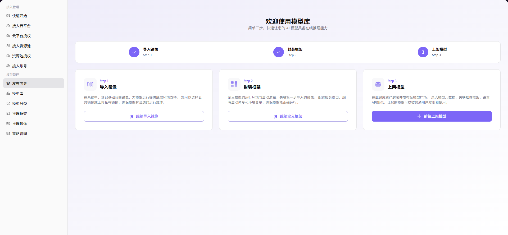

# 发布向导

## 前言

| 项目   | 内容                                               |
| ---- | ------------------------------------------------ |
| 适用角色 | Operator                                          |
| 导航路径 | 模型管理 > 发布向导                                      |
| 功能定位 | 为运营人员提供模型库快速启用流程，通过三个步骤引导完成镜像导入、框架封装和模型上架 |

## 页面结构

### 搜索区域

无（该页面为引导页面，采用步骤式流程，无需搜索功能）。

### 操作按钮区

每个步骤提供对应的操作按钮：「**继续导入镜像**」、「**继续定义框架**」、「**前往上架模型**」。

### 数据列表说明

主内容区显示发布向导流程，包含 Step 1（导入镜像）、Step 2（封装框架）、Step 3（上架模型）三个引导步骤。

### 页面截图

## 操作步骤

### 模型库快速开始流程

1. 进入平台首页，点击左侧导航栏的 **"模型管理 > 发布向导"** 菜单，进入发布向导页面。
2. 按照页面引导，依次完成以下 3 个步骤：

**Step 1：导入镜像**
- 点击「**继续导入镜像**」按钮，登记基础容器镜像，为模型运行提供底层环境支持（可选择公共镜像或上传私有镜像）。

**Step 2：封装框架**
- 点击「**继续定义框架**」按钮，定义模型的运行环境与启动逻辑，关联已导入的镜像，配置服务端口、启动命令和环境变量。

**Step 3：上架模型**
- 点击「**前往上架模型**」按钮，录入模型元数据，关联推理框架，设置 API 规范，完成资产封装并发布至模型广场。

## 注意事项

- 导入镜像是发布流程的第一步，必须先完成镜像导入才能进行框架封装
- 框架定义时需要关联已导入的镜像，确保环境配置正确
- 上架模型前请确认所有配置信息准确无误，发布后将对外可见