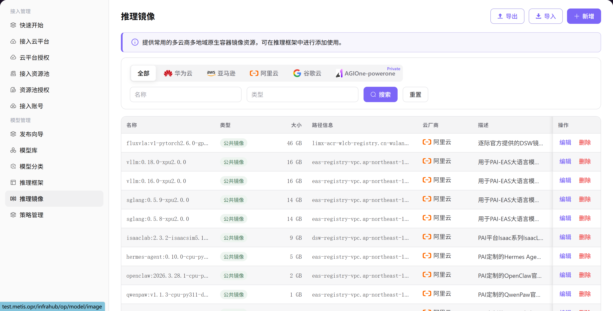

# 推理镜像

## 前言

| 项目   | 内容                                               |
| ---- | ------------------------------------------------ |
| 适用角色 | Operator                                          |
| 导航路径 | 模型管理 > 推理镜像                                      |
| 功能定位 | 提供常用多云商多地域原生容器镜像资源，可添加后在推理框架中使用，为模型部署提供预配置的运行环境支持 |

## 页面结构

### 搜索区域

页面顶部提供云平台筛选（全部 / AGIOne / 华为云 / 谷歌云 / 阿里云 / 亚马逊）、名称搜索框、类型搜索框，以及 **"搜索"** 和 **"重置"** 按钮。

### 操作按钮区

页面右上角提供 **"导出"**、**"导入"** 和 **"新增"** 按钮，用于批量配置管理和镜像添加。

### 数据列表说明

数据表格展示推理镜像列表，包含 名称、类型、大小、路径信息、云厂商、描述、创建时间 及操作列（编辑 / 删除）。

### 页面截图

## 操作步骤

### 添加推理镜像

1. 进入平台首页，点击左侧导航栏的 **"模型管理 > 推理镜像"** 菜单，进入推理镜像管理页面。
2. 点击页面右上角的 **"新增"** 按钮，弹出「新增镜像」窗口。
3. 配置镜像信息：
   - 选择 **云平台**（如 云平台、华为云、亚马逊 等）；
   - 选择 **地域**；
   - 选择 **类型（公共镜像 / 私有镜像）**；
   - 填写 **名称**（如 `ppu-training`）；
   - 填写 **路径信息**（容器镜像地址）；
   - （可选）填写 **描述**，说明镜像核心库及适用模型类型。
1. 确认所有信息配置无误后，点击 **"Confirm"** 按钮完成添加。

#### 参数说明

| 字段名称 | 字段类型 | 示例                                                    | 说明                 |
| ---- | ---- | ----------------------------------------------------- | ------------------ |
| 云平台  | 单选   | `aliyun`                                              | 必填，支持多云商选择         |
| 地域   | 下拉选择 | `cn-shanghai`                                         | 必填，选择镜像所属的地域       |
| 类型   | 单选   | `公共镜像` / `私有镜像`                                       | 必填，标识镜像的公开/私有属性    |
| 名称   | 文本   | `fluxvla:v1-pytorch2.6.0-gpu-py310-cu126-ubuntu22.04` | 必填，自定义镜像标识         |
| 路径信息 | 文本   | `sw-registry-vpc.cn-shanghai.cr.aliyuncs.com/pai`     | 必填，容器镜像的完整地址       |
| 描述   | 文本   | —                                                     | 选填，说明镜像用途、核心库及适用场景 |

## 其他操作

| 操作名称      | 操作步骤                                                    |
| --------- | ------------------------------------------------------- |
| 编辑镜像      | 点击目标镜像的 **"编辑"** 按钮 → 修改云平台、地域、名称、路径信息等内容 → 点击 **"确定"** |
| 删除镜像      | 点击目标镜像的 **"删除"** 按钮 → 确认操作（**删除后数据将无法恢复，请谨慎操作**）        |
| 导出 / 导入配置 | 点击页面右上角的 **"导出"** / **"导入"** 按钮 → 批量管理推理镜像配置            |

## 注意事项

- **删除操作不可逆**，请谨慎操作。
- 添加镜像时，确保镜像路径正确且已正确推送到目标云平台的容器镜像仓库。
- 对于私有镜像，确保云账号有正确的权限访问镜像仓库。
- 多个镜像可能名称相似但地域或类型不同，操作前请仔细确认。