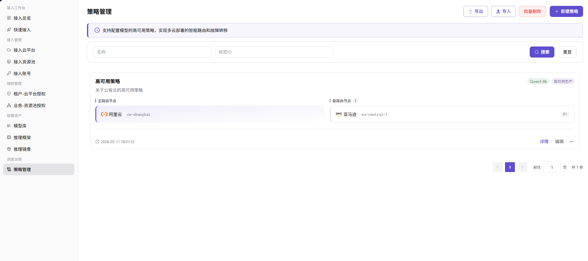

# 策略管理

## 前言

| 项目   | 内容                                               |
| ---- | ------------------------------------------------ |
| 适用角色 | 运营方                                          |
| 导航路径 | 调度治理 > 策略管理                                      |
| 功能定位 | 集中管理多云调度平台上的调度策略与治理规则，用于约束资源调度、流量分配、限流降级等运行时行为 |

## 页面结构

### 搜索区域

页面顶部提供策略名称搜索、策略类型筛选、状态筛选（All / 启用 / 禁用），以及 **"搜索"** 和 **"重置"** 按钮。

### 操作按钮区

页面右上角提供 **"新增策略"**、**"导出"** 和 **"导入"** 按钮，用于策略创建与批量配置管理。

### 数据列表说明

数据表格展示策略列表，包含策略名称、策略类型、描述、关联范围、状态、创建时间、操作列（详情 / 编辑 / 启用-禁用 / ...）。

## 操作步骤

### 新增策略

1. 进入平台首页，点击左侧导航栏的 **"调度治理 > 策略管理"** 菜单，进入策略管理页面。
2. 点击页面右上角的 **"新增策略"** 按钮，弹出「新增策略」窗口。

3. 配置策略信息：
   - 填写 **"策略名称"** 与 **"策略描述"**；
   - 选择 **"策略类型"**（如调度策略 / 流量分配 / 限流降级 / 兜底路由等）；
   - 配置 **"关联范围"**（适用的云平台 / 业务类型 / 租户）；
   - 配置 **"策略规则"**（按策略类型提供的具体规则项）。
4. 确认所有信息配置无误后，点击 **"确定"** 按钮完成添加。

#### 参数说明

| 字段名称 | 字段类型 | 示例 | 说明 |
|----------|----------|------|------|
| 策略名称 | 文本 | `infer-default-policy` | 必填，自定义策略标识 |
| 策略描述 | 文本 | — | 选填，用于说明策略用途与适用场景 |
| 策略类型 | 单选 | `调度策略` | 必填，标识策略的类别 |
| 关联范围 | 多选 | `阿里云 / 推理部署` | 必填，配置策略适用的云平台与业务类型 |
| 策略规则 | 列表 | — | 必填，按策略类型提供的具体规则配置项 |
| 状态 | 单选 | `启用` / `禁用` | 必填，控制策略是否生效 |

## 其他操作

| 操作名称 | 操作步骤 |
|----------|----------|
| 查看策略详情 | 点击目标策略的 **"详情"** 按钮 → 在「基本信息」和「规则配置」页签中查看策略内容 → 点击左上角返回箭头退出 |
| 编辑策略 | 点击目标策略的 **"编辑"** 按钮 → 修改策略描述、关联范围、规则配置等信息 → 点击 **"确定"** |
| 启用 / 禁用 | 点击目标策略的 **"启用"** / **"禁用"** 按钮 → 确认状态变更 |
| 删除策略 | 点击目标策略的 **"..."**（更多）按钮 → 选择 **"删除"** → **删除操作不可逆，请谨慎操作** |
| 导出 / 导入配置 | 点击页面右上角的 **"导出"** / **"导入"** 按钮 → 批量管理策略配置 |

## 注意事项

- **删除操作不可逆**，请谨慎操作；删除前应先解除该策略与所有关联范围的绑定
- 启用策略前请确保关联范围内已有可调度的资源或服务，否则策略可能不生效
- 修改策略规则后，可能需要等待一定时间（数秒到数分钟）才能在全平台生效
- 多个策略可能存在优先级冲突，配置时请参考策略类型的优先级说明
- 策略是平台调度与治理的核心配置，变更前应在测试环境验证后再应用到生产环境
