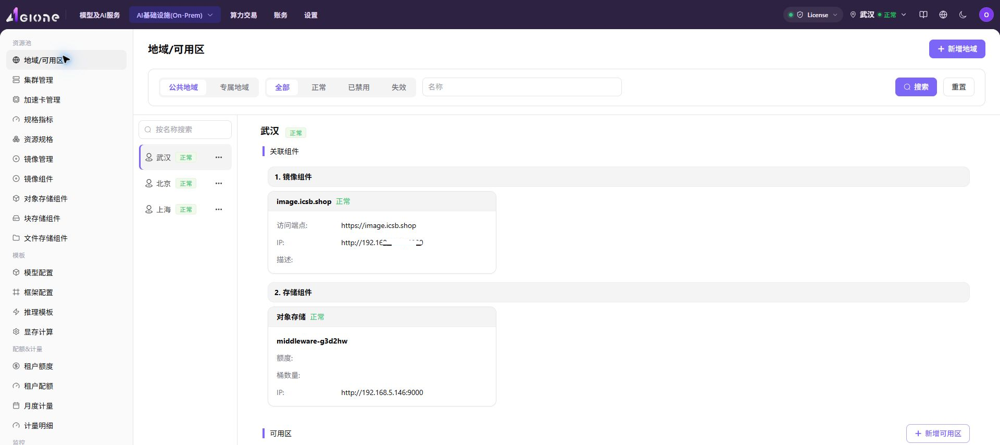
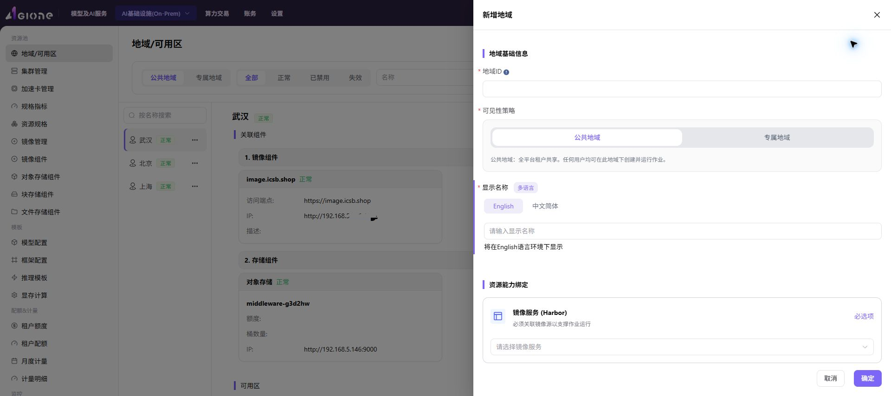
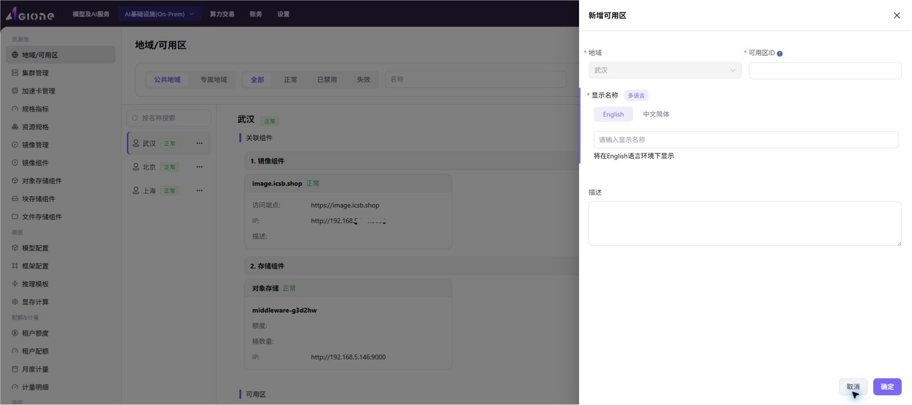
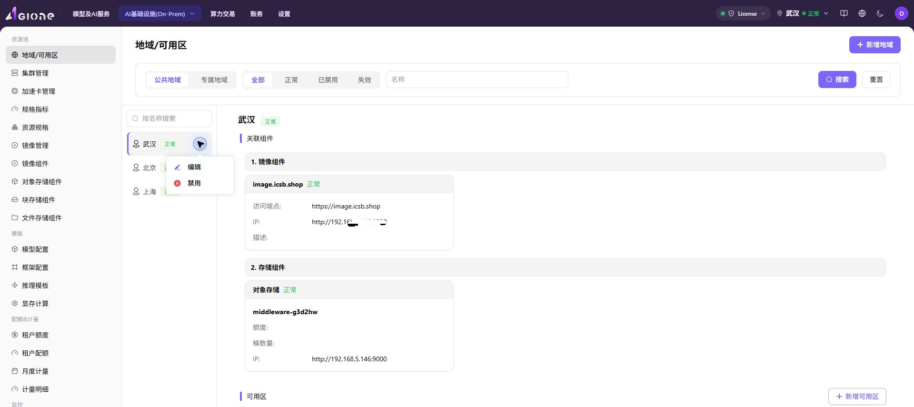

# 地域/可用区

## 功能概述

`地域/可用区` 用于维护 AI Infra-On Prem 资源池的逻辑资源边界。运营方需要先创建地域，再在地域下创建可用区，随后才能在对应可用区中注册集群、承载作业并查看资源使用情况。

| 项目 | 内容 |
| --- | --- |
| 适用角色 | 运营方 |
| 导航路径 | 资源池 > 地域/可用区 |
| 英文页面名称 | Regions & Zones |
| 管理对象 | 地域（Region）、可用区（Availability Zone）、地域关联组件、可用区下的集群资源 |
| 典型用途 | 划分算力资源池、绑定镜像与存储能力、承载集群注册和后续作业调度 |

### 新手理解

可以把 On-Prem 资源池理解成一栋办公体系：

- **地域** 像城市，例如武汉、北京，用来区分大的资源所在范围。
- **可用区** 像城市里的办公区或楼层，用来继续划分具体承载资源的位置。
- **集群** 像办公区里的工位区，提供 CPU、GPU、内存、磁盘等实际算力。
- **作业** 像具体工作，必须被安排到某个集群上运行。
- **公共地域** 像开放式办公区，所有授权用户都可以共用。
- **专属地域** 像带门禁的独立办公室，只允许指定团队或租户使用。

所以第一次配置时，顺序不能反过来：先有地域，再有可用区，再把集群注册到可用区中，最后才能提交作业验证资源是否可用。

### 资源层级关系

### 首次配置流程

首次配置建议按以下顺序执行：

1. 接入镜像服务。镜像服务通常是 Harbor，Harbor 是容器镜像仓库，用于存储和分发作业运行所需镜像。
2. 创建地域，并在地域中绑定可用的镜像服务；如业务需要，再绑定对象存储、文件存储或块存储。
3. 创建可用区，将可用区归属到已创建的地域。
4. 进入 `资源池 > 集群管理`，把 Kubernetes 集群（用于管理计算节点、容器和作业调度的容器编排系统）注册到对应地域和可用区。
5. 按业务需要为集群关联规格和存储。
6. 提交一个测试作业，验证镜像拉取、资源调度、存储挂载和作业运行结果。

## 前提条件

开始配置前，请确认以下条件已满足：

1. 当前账号具备运营方权限，并能进入 `资源池 > 地域/可用区` 页面。
2. 至少已接入一个可用的镜像服务。镜像服务下拉为空时，优先到 `资源池 > 镜像组件` 检查组件是否已接入、已启用，以及当前账号是否有查看或绑定权限。
3. 如需在地域中使用对象存储、文件存储或块存储，需提前完成对应存储组件接入；下拉为空通常表示对应组件未接入、未启用或当前账号无权限。
4. 如后续要注册集群，需提前规划地域 ID、可用区 ID、显示名称和集群归属关系。

## 页面说明

页面由筛选区、地域列表和地域详情区组成。进入页面后，系统默认展示符合当前筛选条件的地域列表；选中某个地域后，右侧展示该地域的组件绑定、可用区和集群资源。

截图中右上角为 `新增地域` 入口，左侧为地域列表，右侧为当前地域的组件绑定和可用区资源区域。

### 筛选区

筛选区位于页面顶部，用于缩小地域列表范围。

| 筛选项 | 说明 |
| --- | --- |
| 地域类型 | 按 `公共地域` 或 `专属地域` 筛选。公共地域可供全平台租户共享；专属地域用于限定使用范围。 |
| 状态 | 按 `全部`、`正常`、`已禁用`、`失效` 筛选地域。 |
| 名称 | 输入地域名称关键字后点击 `搜索`，可快速定位地域；点击 `重置` 清空筛选条件。 |

### 地域列表

左侧地域列表展示地域名称、状态和更多操作入口。点击地域名称后，右侧详情区会刷新为当前地域的信息。

地域列表中的 `...` 菜单用于执行地域级操作，例如编辑、禁用或启用。

### 地域详情

地域详情展示当前地域关联的资源能力，包括：

- 镜像组件：展示已绑定的镜像服务地址、状态、Endpoint、IP 和描述等信息。
- 存储组件：展示对象存储、文件存储、块存储等已启用组件的配额、桶、IP 或其他配置摘要。
- 可用区：展示该地域下的可用区状态、可用区 ID、更新时间、描述和集群数量。

Endpoint 是服务访问入口，通常用于平台或作业访问对应组件；IP 是服务所在地址或访问地址，用于判断组件网络是否可达。

### 可用区与集群资源

展开可用区后，可查看该可用区下的集群资源使用情况。集群卡片通常展示以下信息：

- 集群名称。
- GPU、CPU、MEM、DISK 资源用量。
- 节点数量、作业数量和创建时间。

资源用量以“已用/总量”格式展示，用于快速判断某个可用区或集群是否存在资源瓶颈。

## 新增地域

### 适用场景

当平台需要接入新的算力资源区域，或需要按机房、城市、业务范围划分资源池时，新增地域。以下场景通常需要新增地域：

- 首次部署 On-Prem 资源池时，至少需要创建一个地域。
- 新增机房、新购算力或接入新的资源供应区域时，可按资源位置创建地域。
- 需要按租户、部门或业务线隔离资源时，可创建专属地域。

### 操作前确认

新增地域前必须已有可用镜像服务。没有镜像服务时，即使地域能创建，后续作业也可能无法拉取运行镜像。

建议先确认：

1. `资源池 > 镜像组件` 中已有可用镜像服务。
2. 当前账号具备绑定该镜像服务的权限。
3. 需要启用对象存储、文件存储或块存储时，对应组件已在 `资源池 > 对象存储组件`、`资源池 > 文件存储组件` 或 `资源池 > 块存储组件` 中完成接入并处于可用状态。
4. 地域 ID 已按长期规划确定。地域 ID 是资源边界标识，创建后不可修改。

### 操作步骤

1. 进入 `资源池 > 地域/可用区`。
2. 点击页面右上角的 `新增地域`，打开新增地域弹窗。
3. 在 `地域基础信息` 区块填写地域 ID、可见性策略和多语言显示名称。
4. 在 `资源能力绑定` 区块选择镜像服务，并按需开启对象存储、文件存储或块存储。

截图中右侧抽屉为新增地域表单，上半部分填写地域基础信息，下半部分绑定镜像服务和存储组件。

5. 确认配置无误后，点击 `确定` 提交。
6. 如需放弃本次配置，点击 `取消` 关闭弹窗。

### 参数说明

#### 存储组件选择说明

| 组件类型 | 适用场景 | 判断建议 |
| --- | --- | --- |
| 对象存储 | 存放模型文件、数据集、产物包等非结构化数据。 | 需要通过桶或对象路径读写数据时开启。 |
| 文件存储 | 多节点或多个作业需要共享同一目录。 | 需要共享文件系统、并发读写或目录挂载时开启。 |
| 块存储 | 为计算节点或工作负载提供独立磁盘卷。 | 需要独立卷、低层块设备能力或特定存储性能时开启。 |

#### 新增地域参数

| 字段名称 | 是否必填 | 字段类型 | 示例 | 填写说明 |
| --- | --- | --- | --- | --- |
| 地域 ID | 是 | 文本 | `wuhan` | 地域的唯一标识。UI 校验已确认：仅允许小写字母、数字和连字符 `-`；创建后不可修改。推荐使用城市拼音、机房代号或业务区域代号。 |
| 可见性策略 | 是 | 二选一 | `公共地域` / `专属地域` | 公共地域适合共享测试资源池、公共训练资源池等多租户共用场景；专属地域适合部门或租户独占生产算力资源池。 |
| 显示名称（多语言） | 是 | 多语言 Tab | 中文简体 `武汉` / English `Wuhan` | 分别维护不同语言环境下的显示名称。建议保持语义一致，避免中英文名称指向不同区域。 |
| 镜像服务（Harbor） | 是 | 下拉选择 | `image.example.local` | 地域关联的容器镜像仓库，作业拉取镜像依赖该配置。下拉为空通常表示镜像组件未接入、未启用或当前账号无权限。 |
| 对象存储 | 否 | 开关 + 下拉选择 | 开启 / 关闭 | 用于非结构化数据、模型文件等对象数据存储。下拉为空通常表示对象存储组件未接入、未启用或当前账号无权限。 |
| 文件存储 | 否 | 开关 + 下拉选择 | 开启 / 关闭 | 用于多节点并发读写的共享文件系统。下拉为空通常表示文件存储组件未接入、未启用或当前账号无权限。 |
| 块存储 | 否 | 开关 + 下拉选择 | 开启 / 关闭 | 用于为计算节点提供独立磁盘卷。下拉为空通常表示块存储组件未接入、未启用或当前账号无权限。 |

### 踩坑提示

- 地域 ID 创建后不可修改，提交前必须确认命名、区域含义和租户边界。
- 镜像服务不可用会影响作业拉取镜像，新增地域前应先确认镜像组件状态正常。
- 存储组件不是必选项，只在业务确实需要对应存储能力时开启。
- 公共地域会扩大资源可见范围，专属地域会限制资源范围；配置前应先确认租户或部门边界。

### 结果校验

提交成功后，按以下方式检查配置是否生效：

1. 在左侧地域列表中确认新增地域已出现。
2. 确认地域状态为 `正常` 或符合预期状态。
3. 选中该地域，在右侧详情区确认镜像组件已显示。
4. 如开启了存储组件，确认对应存储组件出现在关联组件列表中。
5. 如后续要注册集群，进入集群注册页面确认该地域可被选择。

## 新增可用区

### 适用场景

当一个地域下需要承载新的集群，或需要按机房机架、网络域、资源组继续拆分资源时，新增可用区。以下场景通常需要新增可用区：

- 同一地域下有多套集群，需要按集群组划分资源。
- 同一城市或机房中存在不同机房区域、楼层、网络域或机架区域。
- 需要做网络隔离、故障隔离或资源分组，避免所有集群混在同一可用区下。

### 操作前确认

新增可用区前必须先创建并选中目标地域。可用区不能脱离地域存在，归属选错会影响后续集群注册和作业调度。

建议先确认：

1. 目标地域已创建，且状态为 `正常` 或符合当前操作预期。
2. 已在左侧地域列表中选中目标地域。
3. 可用区 ID 已按地域规划确定，建议包含地域前缀和序号，例如 `wuhan-1`、`wuhan-gpu-1`。
4. 可用区 ID 创建后不可修改。

### 操作步骤

1. 在左侧地域列表中选择目标地域。
2. 在右侧 `可用区` 区块点击 `+ 新增可用区`，打开新增可用区弹窗。
3. 确认 `地域` 字段为目标地域。
4. 填写可用区 ID。
5. 在多语言 Tab 中分别填写可用区显示名称。
6. 按需填写描述，例如地理位置、机房编号或业务用途。

截图中右侧抽屉为新增可用区表单，顶部展示当前归属地域，中部填写可用区 ID 和多语言显示名称。

7. 点击 `确定` 提交。

### 参数说明

| 字段名称 | 是否必填 | 字段类型 | 示例 | 填写说明 |
| --- | --- | --- | --- | --- |
| 地域 | 是 | 下拉选择 | `武汉` | 可用区所属的上级地域。新增时通常由当前选中地域自动带入；提交前应确认归属正确。 |
| 可用区 ID | 是 | 文本 | `wuhan-1` | 可用区唯一标识。本轮 UI 验证未出现明确字符硬规则；推荐使用小写字母、数字和连字符组合，如 `wuhan-1`、`wuhan-gpu-1`。编辑可用区页面已确认该字段禁用，创建后不可修改。 |
| 显示名称（多语言） | 是 | 多语言 Tab | 中文简体 `武汉-1` / English `Wuhan-1` | 不同语言环境下展示的可用区名称。建议与可用区 ID 的区域含义保持一致。 |
| 描述 | 否 | 多行文本 | `武汉一区` | 可填写机房位置、用途、网络边界或维护说明，便于后续运维识别。 |

### 踩坑提示

- 新增可用区前必须先选择目标地域，不要在错误地域下创建可用区。
- 可用区 ID 创建后不可修改，建议带地域前缀和序号，避免多个地域下出现难以区分的名称。
- 可用区创建后还不能直接运行作业，需要继续在该可用区下注册集群。

### 结果校验

提交成功后，按以下方式检查配置是否生效：

1. 在目标地域详情中确认新增可用区已出现。
2. 确认可用区 ID、显示名称和描述符合预期。
3. 确认可用区状态为 `正常` 或符合预期状态。
4. 进入集群注册页面，确认该地域下可以选择新增的可用区。

## 管理地域

### 搜索地域

用于在地域较多时快速定位目标地域。

1. 在顶部 `名称` 输入框输入地域名称关键字。
2. 点击 `搜索`。
3. 在左侧地域列表中查看筛选结果。
4. 如需恢复默认列表，点击 `重置`。

也可以使用左侧地域列表上方的 `按名称搜索` 输入框，在当前列表范围内快速定位地域。

### 筛选地域

地域类型和状态筛选可叠加使用。

| 操作 | 结果 |
| --- | --- |
| 选择 `公共地域` | 仅展示公共地域。 |
| 选择 `专属地域` | 仅展示专属地域。 |
| 选择 `正常` | 仅展示当前可用的地域。 |
| 选择 `已禁用` | 仅展示已禁用的地域。 |
| 选择 `失效` | 仅展示失效地域。 |

### 编辑地域

当地域显示名称、可见性策略或资源能力绑定需要调整时，可编辑地域。

1. 在左侧地域列表中找到目标地域。
2. 点击目标地域右侧的 `...`。
3. 选择 `编辑`。
4. 按需调整可编辑字段。
5. 点击 `确定` 保存。

截图中左侧地域卡片右侧的 `...` 展开后，可看到 `编辑` 和 `禁用` 入口。

编辑地域前应确认调整影响。特别是可见性策略和资源能力绑定，可能影响租户可见范围、作业镜像拉取或存储能力。

### 禁用或启用地域

当某个地域需要维护、下线或临时停止承载新资源时，可禁用地域。禁用前应确认该地域下是否仍有可用区、集群或运行中的作业。

1. 在左侧地域列表中找到目标地域。
2. 点击目标地域右侧的 `...`。
3. 选择 `禁用` 或 `启用`。
4. 阅读确认提示，确认影响范围。
5. 确认后提交。

禁用地域通常会影响该地域下新资源的创建或新作业调度。操作前应确认是否仍有集群、运行作业或租户资源依赖。

## 管理可用区

### 编辑可用区

当可用区显示名称或描述需要调整时，可编辑可用区。

1. 选择目标地域。
2. 在右侧 `可用区` 区块找到目标可用区。
3. 点击可用区行中的 `编辑`。
4. 修改可编辑字段。
5. 点击 `确定` 保存。

### 禁用或启用可用区

当某个可用区需要维护或暂停承载新作业时，可禁用可用区。

1. 选择目标地域。
2. 在右侧 `可用区` 区块找到目标可用区。
3. 点击 `禁用` 或 `启用`。
4. 阅读确认提示并提交。

禁用可用区通常会影响该可用区下的新作业分配。操作前应确认该可用区下集群和作业的当前状态。

### 查看可用区资源

1. 选择目标地域。
2. 在右侧 `可用区` 区块展开目标可用区。
3. 查看该可用区下的集群列表。
4. 根据 GPU、CPU、MEM、DISK 用量判断资源负载。
5. 如发现资源不足，进入 `集群管理` 查看集群详情、节点和监控数据。

## 配置规则与影响

- **配置顺序**：必须先创建地域，再创建可用区，最后才能在对应可用区下注册集群。
- **镜像服务**：新增地域时应绑定可用镜像服务，否则后续作业可能无法正常拉取镜像。
- **存储组件**：对象存储、文件存储和块存储按需开启。未接入对应组件时，不应在地域中强行启用。
- **公共地域**：适合全平台共享资源池，例如共享测试资源池或公共训练资源池。
- **专属地域**：适合限定租户、限定业务或隔离资源池，例如部门独占 GPU 资源池。
- **禁用影响**：禁用地域或可用区可能影响新作业调度、新集群注册或新资源创建。生产环境操作前应确认业务窗口和影响范围。
- **资源观察**：可用区下的集群资源用量用于快速判断容量，不替代集群节点监控；排查资源瓶颈时应进入集群或节点详情页。

## 常见问题

### 镜像服务下拉为空

**现象**：新增地域时，镜像服务下拉列表没有可选项。

**可能原因**：

- 镜像组件尚未接入。
- 镜像组件已接入但未启用或状态异常。
- 当前账号没有查看或绑定镜像服务的权限。

**处理方式**：

1. 进入 `资源池 > 镜像组件`，检查是否已有可用镜像服务。
2. 确认镜像服务状态正常，Endpoint 或访问地址可用。
3. 确认当前账号具备绑定该镜像服务的权限。
4. 返回新增地域弹窗并刷新页面后重试。

### 存储组件无法开启或下拉为空

**现象**：对象存储、文件存储或块存储无法选择，或者开启后没有可选组件。

**可能原因**：

- 对应存储组件尚未接入。
- 组件未启用、状态异常或不可绑定。
- 当前账号没有对应组件的查看或绑定权限。

**处理方式**：

1. 根据组件类型进入 `资源池 > 对象存储组件`、`资源池 > 文件存储组件` 或 `资源池 > 块存储组件`。
2. 检查组件是否已接入并处于可用状态。
3. 检查组件是否与目标地域规划一致。
4. 确认权限后重新打开新增地域弹窗。

### 地域状态异常

**现象**：地域创建后不是 `正常` 状态，或筛选时出现在 `已禁用`、`失效` 列表中。

**可能原因**：

- 地域被手动禁用。
- 绑定的镜像服务或存储组件状态异常。
- 地域配置未满足平台检查条件。

**处理方式**：

1. 取消状态筛选，确认地域是否存在。
2. 打开地域详情，检查镜像组件和存储组件状态。
3. 如地域被禁用，确认影响范围后再执行启用。
4. 如组件异常，先修复对应组件，再回到地域页面确认状态。

### 可用区 ID 报错

**现象**：新增可用区时，可用区 ID 无法提交或系统提示校验失败。

**可能原因**：

- 可用区 ID 与已有可用区重复。
- 命名不符合页面校验要求。
- 选错地域，导致 ID 规划与归属不一致。

**处理方式**：

1. 检查当前选中的地域是否正确。
2. 使用包含地域前缀和序号的建议格式，例如 `wuhan-1`。
3. 避免使用临时含义、空格或难以识别的命名。
4. 如仍无法提交，改用小写字母、数字和连字符组合后重试。

### 地域 ID / 可用区 ID 命名不规范，后续难以维护怎么办？

**现象**：地域或可用区已经创建，但 ID 含义不清晰，后续注册集群、排查资源归属或做容量统计时难以判断资源边界。

**可能原因**：

- 使用了过于临时的名称，例如 `test1`。
- 使用了无业务含义的名称，例如 `aaa`。
- 使用了看似规范但缺少地域含义的名称，例如 `region01`。
- 没有在可用区 ID 中体现所属地域、资源类型或序号。

**处理方式**：

1. 新建资源时优先使用能体现地域和层级的命名。
2. 推荐地域 ID：`wuhan`、`prod-wuhan`。
3. 推荐可用区 ID：`wuhan-1`、`wuhan-gpu-1`、`prod-wuhan-1`。
4. 不推荐：`test1`，原因是测试含义会随时间失效；`aaa`，原因是无法识别资源归属；`region01`，原因是无法判断实际地域。
5. 已创建的地域 ID 和可用区 ID 在编辑页面均为禁用，创建后不可修改；如命名已经影响维护，应规划新地域或新可用区，并逐步迁移集群和作业。

### 禁用地域失败

**现象**：点击禁用地域后失败，或系统提示存在依赖资源。

**可能原因**：

- 地域下仍有可用区或集群。
- 地域下存在运行中的作业或资源依赖。
- 当前账号权限不足。

**处理方式**：

1. 展开地域详情，检查可用区和集群资源。
2. 进入 `资源池 > 集群管理`，确认相关集群状态和作业情况。
3. 在业务窗口内完成作业迁移或资源下线。
4. 确认权限和影响范围后再次执行禁用。

### 可用区下没有集群资源

**现象**：可用区已创建，但展开后没有集群卡片或资源用量。

**可能原因**：

- 还没有在该可用区下注册集群。
- 集群注册到了其他地域或可用区。
- 集群状态异常，资源信息未正常展示。

**处理方式**：

1. 进入 `资源池 > 集群管理`，检查是否已有集群归属到该地域和可用区。
2. 如没有集群，先按首次配置流程注册集群。
3. 如集群归属错误，按平台支持的方式调整或重新注册。
4. 如集群状态异常，进入集群详情和节点页继续排查。

## 后续操作

完成本章节后，请继续检查或执行以下事项：

1. 进入 `资源池 > 集群管理` 注册集群，并确认新增地域和可用区可被选择。
2. 在地域详情中确认镜像服务状态正常，Endpoint 和 IP 信息符合预期。
3. 如启用了存储组件，确认对象存储、文件存储或块存储组件状态正常。
4. 为目标集群关联规格和必要存储。
5. 提交测试作业，确认镜像可拉取、资源可调度、存储可挂载、作业可正常运行。

## 注意事项

> ⚠️ 安全提示
>
> 不要在文档、截图、工单或评论中写入真实账号、密码、token、AK/SK、私钥、证书或完整 kubeconfig。

- 地域 ID 和可用区 ID 都是资源边界标识，建议按长期规划命名，避免临时命名。
- 地域 ID 仅允许小写字母、数字和连字符；可用区 ID 推荐同样使用小写字母、数字和连字符组合。
- 地域 ID 和可用区 ID 创建后不可修改，提交前应确认命名、归属和显示名称。
- 截图前应检查页面中是否暴露凭据、token、证书、私钥、访问密钥或内部敏感数据。
- 当前账号需要具备查看和绑定镜像、存储、地域、可用区的权限；下拉为空时应先排查组件状态和账号权限。
