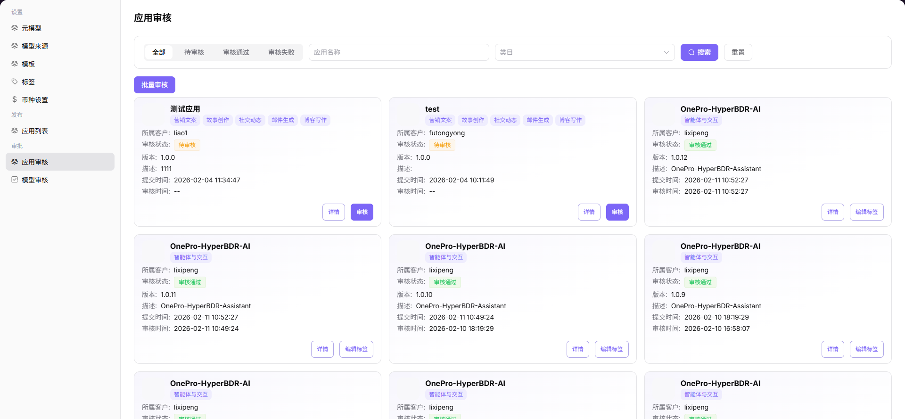

# 应用审核

## 前言

| 项目   | 内容                       |
| ---- | ------------------------ |
| 适用角色 | Operator                      |
| 导航路径 | 审批 > 应用审核                |
| 功能定位 | 审核用户提交的应用发布申请，确保应用质量和合规性 |

## 页面结构

### 搜索区域

页面顶部提供筛选功能，支持按审核状态、所属类目进行筛选。

### 操作按钮区

* 每个应用卡片提供 **"详情"** 按钮，用于查看完整信息
* 每个应用卡片提供 **"审核"** 按钮，用于执行审核操作
* 每个已通过应用卡片提供 **"编辑标签"** 按钮
* 页面提供 **"批量审核"** 按钮，用于批量处理审核

### 数据列表说明

页面以卡片形式展示所有待审核 / 已审核的应用，每个卡片包含应用名称、所属类目、客户、审核状态、版本、提交时间等信息。

### 页面截图

## 操作步骤

### 查看应用列表

1. 进入平台首页，点击左侧导航栏的 **"审批 > 应用审核"** 菜单，进入应用审核管理页面。
2. 页面展示所有待审核 / 已审核的应用卡片，卡片包含应用名称、所属类目、客户、审核状态、版本、提交时间等信息。

#### 参数说明

| 字段名称 | 字段类型 | 示例                          | 说明        |
| ---- | ---- | --------------------------- | --------- |
| 应用名称 | 文本   | `测试应用 / OnePro-HyperBDR-AI` | 待审核应用的名称  |
| 所属类目 | 标签   | `营销文案 / 智能体与交互`             | 应用的功能分类标签 |
| 所属客户 | 文本   | `liao1 / lixipeng`          | 提交应用的客户名称 |
| 审核状态 | 状态标签 | `待审核 / 审核通过 / 审核失败`         | 应用当前的审核状态 |
| 版本   | 文本   | `1.0.0 / 1.0.12`            | 应用的提交版本号  |
| 提交时间 | 时间   | `2026-02-04 11:34:47`       | 应用提交审核的时间 |
| 审核时间 | 时间 | `2026-02-11 10:52:27` | 应用完成审核的时间 |

## 其他操作

| 操作名称 | 操作步骤 |
|----------|----------|
| 查看详情 | 点击目标应用卡片的 **"详情"** 按钮 → 查看应用信息、配置、测试情况等完整信息 |
| 单个审核 | 点击目标应用卡片的 **"审核"** 按钮 → 在审核弹窗中查看应用信息、配置、标签 → 点击「通过」或「拒绝」完成审核 |
| 批量审核 | 点击「批量审核」按钮，勾选多个待审核应用 → 点击「通过」或「拒绝」批量处理审核 |
| 编辑标签 | 点击已通过应用卡片的 **"编辑标签"** 按钮 → 选择标签（无 / 热门 / 推荐 / 最新）→ 点击「确定」保存 |

## 注意事项

* 审核操作需谨慎，确保应用符合平台规范后再通过。
* 批量审核时，请仔细核对每个应用的信息后再执行。
* 审核拒绝时，建议填写拒绝原因以便客户了解改进方向。
