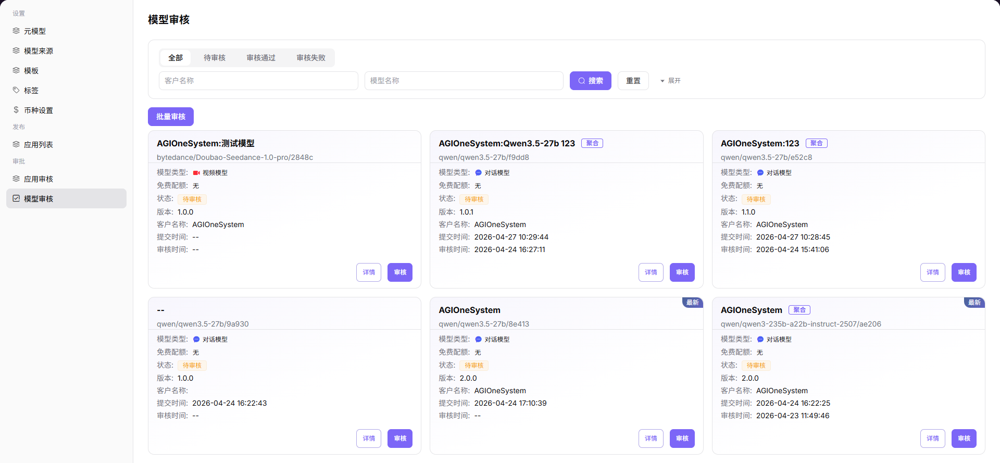

# 模型审核

## 前言

| 项目   | 内容                         |
| ---- | -------------------------- |
| 适用角色 | Operator                        |
| 导航路径 | 审批 > 模型审核                  |
| 功能定位 | 审核用户提交的模型发布申请，确保模型质量和服务合规性 |

## 页面结构

### 搜索区域

页面顶部提供筛选功能，支持按审核状态、模型类型进行筛选。

### 操作按钮区

* 每个模型卡片提供 **"详情"** 按钮，用于查看完整信息
* 每个模型卡片提供 **"审核"** 按钮，用于执行审核操作
* 页面提供 **"批量审核"** 按钮，用于批量处理审核

### 数据列表说明

页面以卡片形式展示所有待审核 / 已审核的模型，每个卡片包含模型名称、类型、免费配额模式、客户、状态、版本、提交时间等信息。

### 页面截图

## 操作步骤

### 查看模型列表

1. 进入平台首页，点击左侧导航栏的 **"审批 > 模型审核"** 菜单，进入模型审核管理页面。
2. 页面展示所有待审核 / 已审核的模型卡片，卡片包含模型名称、类型、免费配额模式、客户、状态、版本、提交时间等信息。

#### 参数说明

| 字段名称   | 字段类型 | 示例                                 | 说明          |
| ------ | ---- | ---------------------------------- | ----------- |
| 模型名称   | 文本   | `qwen-image-2.0 / Qwen3-235b-a22b` | 待审核模型的名称    |
| 模型类型   | 标签   | `图片模型 / 对话模型 / 视频模型 / 多模态`         | 模型的功能类型     |
| 免费配额模式 | 文本   | `限额模式 / 无`                         | 模型的免费调用配额配置 |
| 客户名称   | 文本   | `DuShuangYan / AGIOneSystem`       | 提交模型的客户名称   |
| 审核状态   | 状态标签 | `待审核 / 审核通过 / 审核失败`                | 模型当前的审核状态   |
| 版本     | 文本   | `1.0.0`                            | 模型的提交版本号    |
| 提交时间   | 时间   | `--`                               | 模型提交审核的时间   |
| 审核时间 | 时间 | `--` | 模型完成审核的时间 |

## 其他操作

| 操作名称 | 操作步骤 |
|----------|----------|
| 查看详情 | 点击目标模型卡片的 **"详情"** 按钮 → 查看模型信息、配置、测试情况等完整信息 |
| 单个审核 | 点击目标模型卡片的 **"审核"** 按钮 → 在审核弹窗中查看模型信息、配置、标签 → 点击「通过」或「拒绝」完成审核 |
| 批量审核 | 点击「批量审核」按钮，勾选多个待审核模型 → 点击「通过」或「拒绝」批量处理审核 |

## 注意事项

* 审核操作需谨慎，确保模型符合平台规范后再通过。
* 批量审核时，请仔细核对每个模型的信息后再执行。
* 审核拒绝时，建议填写拒绝原因以便客户了解改进方向。
