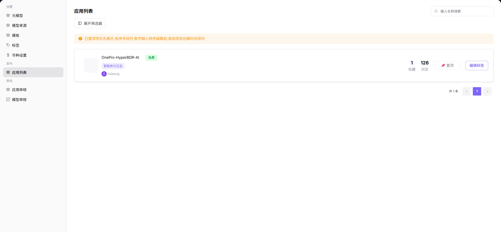

# 应用列表

## 前言

| 项目 | 内容 |
|------|------|
| 适用角色 | Operator |
| 导航路径 | 设置 > 应用列表 |
| 功能定位 | 查看和管理所有已发布的应用，了解应用的使用情况和热门程度 |

## 页面结构

### 搜索区域

页面提供应用名称搜索功能。

### 操作按钮区

* 每个应用卡片提供 **"编辑标签"** 按钮，用于修改应用标签
* 每个应用卡片提供 **"置顶"** 按钮，用于设置应用展示顺序

### 数据列表说明

页面以卡片形式展示所有已发布的应用，每个卡片包含应用名称、标签、状态、收藏数、浏览数等信息。

## 操作步骤

### 查看应用列表

1. 进入平台首页，点击左侧导航栏的 **"设置 > 应用列表"** 菜单，进入应用列表管理页面。
2. 在列表中查看所有已发布的应用卡片，卡片展示应用名称、标签、状态、收藏 / 浏览数据等信息。

#### 参数说明

| 字段名称 | 字段类型 | 示例 | 说明 |
|----------|----------|------|------|
| 应用名称 | 文本 | `OnePro-HyperBDR-AI` | 应用的标识名称 |
| 应用标签 | 文本 | `智能体与交互` | 应用的功能分类标签 |
| 应用状态 | 标签 | `免费` | 应用的使用 / 收费状态 |
| 收藏数 | 数值 | `1` | 应用被用户收藏的次数 |
| 浏览数 | 数值 | `126` | 应用被用户浏览的次数 |
| 置顶序号 | 数值 | `1` | 应用的展示排序序号，数字越小越靠前 |

## 其他操作

| 操作名称 | 操作步骤 |
|----------|----------|
| 编辑标签 | 点击目标应用卡片的 **"编辑标签"** 按钮 → 在弹窗中选择标签（无 / 热门 / 推荐 / 最新）→ 点击「确定」保存 |
| 设置置顶 | 点击目标应用卡片的 **"置顶"** 按钮 → 输入置顶序号（数字越小越靠前）→ 确认后应用将按序号优先展示 |
| 查看详情 | 点击应用名称或卡片 → 进入应用详情页，查看完整信息 |

## 注意事项

* 置顶序号数字越小，应用展示位置越靠前。
* 点击应用名称或卡片可进入应用详情页查看完整信息。
