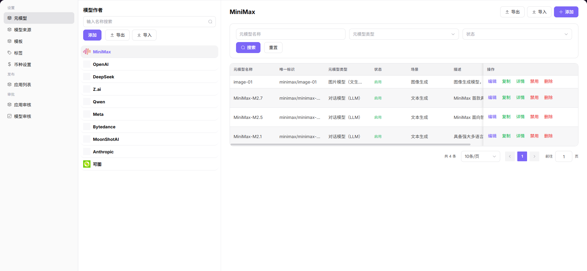

# 元模型

## 前言

| 项目 | 内容 |
|------|------|
| 适用角色 | Operator |
| 导航路径 | 设置 > 元模型 |
| 功能定位 | 管理平台全局的模型作者与元模型配置，为模型发布提供基础数据支撑 |

## 页面结构

### 搜索区域

页面顶部提供搜索与筛选功能，支持按模型作者名称快速定位目标元模型。

### 操作按钮区

* 左侧模型作者列表上方提供 **"添加"** 按钮，用于新增模型作者
* 右侧元模型列表提供 **"+ 添加"** 按钮，用于新增元模型
* 页面右上角提供 **"导出"** / **"导入"** 按钮，用于批量管理配置

### 数据列表说明

左侧展示模型作者列表，右侧对应展示该作者下的元模型列表。

### 页面截图

## 操作步骤

### 添加模型作者

1. 进入平台首页，点击左侧导航栏的 **"设置 > 元模型"** 菜单，进入元模型管理页面。
2. 在左侧模型作者列表上方，点击 **"添加"** 按钮，弹出「添加」窗口。
3. 配置模型作者信息：
   - 填写 **唯一标识**（如 `qwen`）；
   - 配置 **多语言显示名称**（分别填写英文与中文简体环境下的名称）；
   - 上传 **应用图标**。
4. 确认所有信息配置无误后，点击 **"确定"** 按钮完成添加。

#### 参数说明

| 字段名称 | 字段类型 | 示例 | 说明 |
|----------|----------|------|------|
| 唯一标识 | 文本 | `qwen` | 必填，模型作者的唯一标识 |
| 多语言显示名称 | 多语言文本 | `Qwen / 通义千问` | 必填，分别配置英文与中文简体展示名称 |
| 应用图标 | 图片 | `Qwen 品牌图标` | 必填，模型作者展示图标 |

### 添加元模型

1. 在「元模型」管理页面，选择目标模型作者（如 `Qwen`），点击右侧的 **"+ 添加"** 按钮，进入「添加元模型」流程。
2. 配置元模型基础信息：
   - 选择 **模型作者**；
   - 填写 **名称**（如 `Qwen3.6-plus`）；
   - 填写 **系列**（如 `Qwen3.6`）；
   - 选择 **场景**；
   - 设置 **状态**（启用 / 禁用）；
   - 填写 **官方发布时间**；
   - 配置 **多语言描述信息**；
   - 选择 **模型类型**（多模态、对话模型、图片模型等）；
   - 配置 **输入 / 输出模态**（文本、图片、语音、视频）；
   - 开启 / 关闭 **高级能力**（函数 / 工具支持、思考模式）；
   - 设置 **Token 限制**（最大上下文、最大输入、最大输出）；
   - 选择 **官方原生协议**（如 `OpenAI-ChatCompletions`、`OpenAI-Responses`）。
3. 完善元模型详情内容：
   - 填写模型详细介绍，支持富文本格式。
4. 确认所有信息无误后，点击 **"提交"** 按钮完成添加。

#### 参数说明

| 字段名称 | 字段类型 | 示例 | 说明 |
|----------|----------|------|------|
| 模型作者 | 下拉选择 | `Qwen` | 必填，归属的模型作者 |
| 名称 | 文本 | `Qwen3.6-plus` | 必填，自定义元模型标识 |
| 系列 | 文本 | `Qwen3.6` | 必填，模型所属版本系列 |
| 场景 | 下拉选择 | `文本生成 / 多模态对话` | 必填，模型应用业务场景 |
| 状态 | 下拉选择 | `启用 / 禁用` | 必填，控制模型是否可用 |
| 官方发布时间 | 日期 | `2026-01-01` | 必填，模型官方发布日期 |
| 多语言描述信息 | 多语言文本 | `中英文模型简介` | 选填，适配多语言环境展示 |
| 模型类型 | 单选 | `多模态 / 对话模型 / 图片模型` | 必填，划分模型功能类别 |
| 输入 / 输出模态 | 多选 | `文本 / 图片 / 语音 / 视频` | 必填，模型支持的交互介质 |
| 高级能力 | 开关 | `函数调用 / 思考模式` | 选填，开启模型扩展能力 |
| Token 限制 | 数字 | `最大上下文 1024K` | 必填，设置上下文、输入、输出长度上限 |
| 官方原生协议 | 多选 | `OpenAI-ChatCompletions` | 必填，模型适配的接口协议 |
| 元模型详情 | 富文本 | `模型特性、参数介绍` | 选填，模型完整详细说明 |

## 其他操作

| 操作名称 | 操作步骤 |
|----------|----------|
| 编辑模型作者 | 在左侧模型作者列表，点击目标作者的 **"编辑"** 按钮 → 修改显示名称、图标等信息 → 点击 **"确定"** |
| 编辑元模型 | 在元模型列表，点击目标元模型的 **"编辑"** 按钮 → 修改元模型配置 → 提交更新 |
| 复制元模型 | 点击目标元模型的 **"复制"** 按钮 → 基于现有模型快速创建新的元模型 |
| 查看元模型详情 | 点击目标元模型的 **"详情"** 按钮 → 查看完整的模型配置与介绍信息 |
| 启用 / 禁用元模型 | 点击目标元模型的 **"启用"** / **"禁用"** 按钮 → 切换模型的可用状态 |
| 删除模型作者 / 元模型 | 点击目标作者 / 元模型的 **"删除"** 按钮 → 确认操作（**删除后数据将无法恢复，请谨慎操作**） |
| 导出 / 导入配置 | 点击页面右上角的 **"导出"** / **"导入"** 按钮 → 批量管理模型作者或元模型配置 |

## 注意事项

* **删除操作不可逆**，请谨慎操作，删除后数据将无法恢复。
* 导出 / 导入配置前，请确保文件格式正确，避免覆盖现有数据。
* 禁用元模型后，基于该元模型发布的模型将无法对外提供服务。
