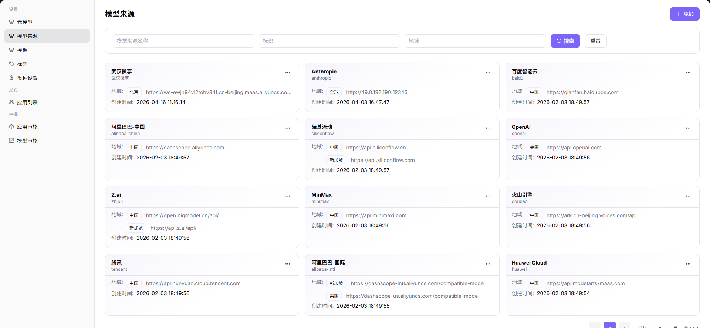

# 模型来源

## 前言

| 项目 | 内容 |
|------|------|
| 适用角色 | Operator |
| 导航路径 | 设置 > 模型来源 |
| 功能定位 | 管理模型服务的来源渠道与地域节点配置，定义 API 调用地址与认证信息 |

## 页面结构

### 搜索区域

页面顶部提供搜索功能，支持按模型来源名称、标识、地域快速定位目标来源。

### 操作按钮区

* 页面右上角提供 **"添加"** 按钮，用于新增模型来源
* 每个模型来源卡片提供 **"..."（更多）** 按钮，包含编辑、详情、删除操作

### 数据列表说明

页面以卡片形式展示所有模型来源，每个卡片包含名称、标识、地域数量等信息。

### 页面截图

## 操作步骤

### 添加模型来源

1. 进入平台首页，点击左侧导航栏的 **"设置 > 模型来源"** 菜单，进入模型来源管理页面。
2. 点击页面右上角的 **"添加"** 按钮，进入「添加模型源」配置页面。
3. 配置模型来源基本信息：
   - 填写 **多语言名称**（分别配置英文与中文简体环境下的名称）；
   - 填写 **模型源标识**（如 `alibaba-china`）。
4. 配置地域信息：
   - 添加地域：填写 **地域标识**、**地域名称（多语言）**、**BASE URL**、**API 密钥地址**、**API 文档地址**；
   - 可通过「添加地域」按钮新增多个地域节点。
5. 配置请求头信息：
   - 添加请求头：填写 **认证字段名称**（如 `Authorization`）与 **认证值**（如 `Bearer <key>`）；
   - 可通过「添加请求头」按钮新增多个请求头配置。
6. 确认所有信息配置无误后，点击 **"确定"** 按钮完成添加。

#### 参数说明

| 字段名称 | 字段类型 | 示例 | 说明 |
|----------|----------|------|------|
| 名称（多语言） | 多语言文本 | `Alibaba / 阿里巴巴` | 必填，模型来源的多语言展示名称 |
| 模型源标识 | 文本 | `alibaba-china` | 必填，模型来源的唯一标识 |
| 地域标识 | 文本 | `china` | 必填，地域节点的唯一标识 |
| 地域名称（多语言） | 多语言文本 | `China / 中国` | 必填，地域节点的多语言名称 |
| BASE URL | 文本 | `https://dashscope.aliyuncs.com` | 必填，模型服务的基础 API 地址 |
| API 密钥地址 | 文本 | `https://bailian.console.aliyun.com` | 选填，获取 API 密钥的官方地址 |
| API 文档地址 | 文本 | `https://bailian.console.aliyun.com/cn-i/` | 选填，模型服务的 API 文档地址 |
| 请求头 - 认证字段名称 | 文本 | `Authorization` | 必填，请求头中的认证字段键名 |
| 请求头 - 认证值 | 文本 | `Bearer <key>` | 必填，请求头中的认证值，支持模板变量 |

## 其他操作

| 操作名称   | 操作步骤                                                                    |
| ------ | ----------------------------------------------------------------------- |
| 编辑模型来源 | 点击目标模型来源卡片的 **"..."（更多）** 按钮 → 选择 **"编辑"** → 修改配置信息 → 点击 **"确定"**       |
| 查看详情   | 点击目标模型来源卡片的 **"..."（更多）** 按钮 → 选择 **"详情"** → 查看完整配置信息                   |
| 删除模型来源 | 点击目标模型来源卡片的 **"..."（更多）** 按钮 → 选择 **"删除"** → 确认操作（**删除后数据将无法恢复，请谨慎操作**） |
| 筛选与搜索  | 输入模型来源名称、标识、地域 → 点击「搜索」快速定位目标来源                                         |

## 注意事项

* **删除操作不可逆**，请谨慎操作，删除后数据将无法恢复。
* 添加地域和请求头时，确保 BASE URL 和认证信息准确，避免调用失败。
* 筛选与搜索功能支持多条件组合，可提高定位效率。
