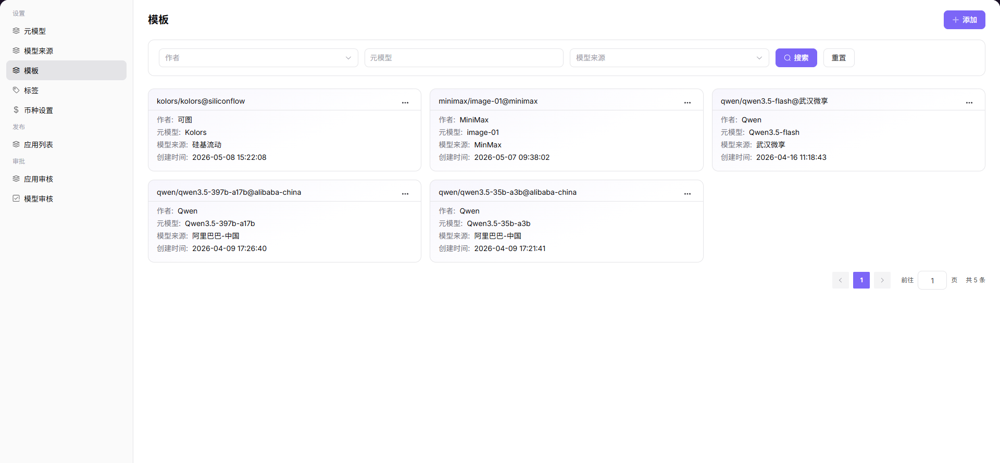

# 模板

## 前言

| 项目 | 内容 |
|------|------|
| 适用角色 | Operator |
| 导航路径 | 设置 > 模板 |
| 功能定位 | 创建和管理模型模板，快速生成基于特定元模型的实例配置 |

## 页面结构

### 搜索区域

页面顶部提供搜索与筛选功能，支持按关键字、模型作者、模型来源快速定位目标模板。

### 操作按钮区

* 页面右上角提供 **"添加"** 按钮，用于创建新模板
* 每个模板卡片提供 **"..."（更多）** 按钮，包含编辑、详情、删除操作
* 页面右上角提供 **"导出"** / **"导入"** 按钮，用于批量管理配置

### 数据列表说明

页面以列表形式展示所有模板，每个模板包含所属作者、模型来源、元模型等信息。

### 页面截图

## 操作步骤

### 添加模板

1. 进入平台首页，点击左侧导航栏的 **"设置 > 模板"** 菜单，进入模板管理页面。
2. 点击页面右上角的 **"添加"** 按钮，进入添加模板流程。
3. 选择基础关联信息：
   - 选择 **模型作者**；
   - 选择 **模型来源** 及对应所属地域；
   - 点击 **"下一步"**。
4. 配置元模型基础信息：
   - 选择 **元模型**；
   - 填写 **模型源 ID**；
   - 配置 **输入 / 输出模态**；
   - 开启或关闭 **高级能力**；
   - 设置 **Token 限制** 相关参数；
   - 选择适配的 **官方原生协议**；
   - 点击 **"下一步"**。
5. 核对模板整体配置信息，确认作者、模型来源、元模型、能力参数无误后，点击 **"提交"** 完成模板添加。

#### 参数说明 - 基础关联信息

| 字段名称 | 字段类型 | 示例 | 说明 |
|----------|----------|------|------|
| 模型作者 | 下拉选择 | `Qwen` | 必填，选择模板归属的模型作者 |
| 模型来源 | 下拉选择 | `阿里巴巴-中国` | 必填，选择模型调用的来源渠道 |
| 地域 | 下拉选择 | `中国` | 必填，选择模型来源对应的可用地域 |

#### 参数说明 - 元模型配置信息

| 字段名称 | 字段类型 | 示例 | 说明 |
|----------|----------|------|------|
| 元模型 | 下拉选择 | `Qwen3.5-397b-a17b` | 必填，选择需要生成模板的元模型 |
| 模型源 ID | 文本 | `qwen3.5-397b-a17b` | 必填，模型在对应源平台的唯一标识 |
| 输入 / 输出模态 | 多选 | `文本、图片` | 必填，配置模板支持的交互数据类型 |
| 高级能力 | 开关 | `函数调用、思考模式` | 选填，开启模型扩展高级能力 |
| Token 限制 | 数值 | `最大上下文 256K` | 必填，设置上下文、输入、输出长度上限 |
| 官方原生协议 | 多选 | `OpenAI-ChatCompletions` | 必填，模板适配的接口协议类型 |

## 其他操作

| 操作名称 | 操作步骤 |
|----------|----------|
| 编辑模板 | 点击目标模板右上角的 **"..."（更多）** 按钮 → 选择 **"编辑"** → 修改关联信息与元模型配置 → 点击 **"提交"** |
| 查看模板详情 | 点击目标模板右上角的 **"..."（更多）** 按钮 → 选择 **"详情"** → 查看完整模板配置信息 → 点击左上角返回箭头退出 |
| 删除模板 | 点击目标模板右上角的 **"..."（更多）** 按钮 → 选择 **"删除"** → **删除操作不可逆，请谨慎操作** |
| 筛选与搜索 | 在页面顶部输入关键字、选择模型作者或模型来源 → 点击 **"搜索"** 按钮 → 快速定位目标模板 |
| 导出 / 导入配置 | 点击页面右上角的 **"导出"** / **"导入"** 按钮 → 批量管理模板配置 |

## 注意事项

* **删除操作不可逆**，请谨慎操作。
* 编辑模板时，修改后的配置将影响基于该模板创建的新实例。
* 导出 / 导入配置前，请确保文件格式正确，避免覆盖现有数据。
