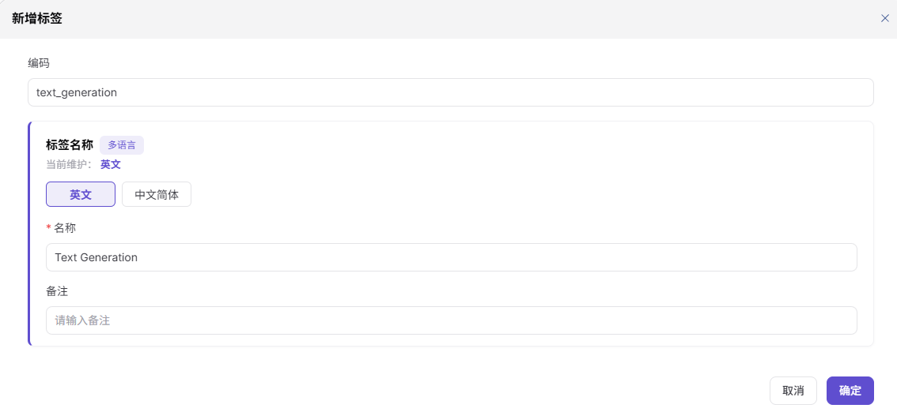

# 标签

## 前言

| 项目   | 内容                                       |
| ---- | ---------------------------------------- |
| 适用角色 | Operator                                    |
| 导航路径 | 设置 > 标签                                    |
| 功能定位 | 定义和管理模型的分类标签体系（英文 UI 标题为 **Tags**），支持一级 + 多级子标签的树形结构，标签用于模型广场的分类与筛选 |

## 页面结构

### 搜索区域

页面顶部提供 **标签类型 Tab**（截图当前仅展示 **Model** 类型）+ **状态 Tab**（**All** / Available / Unavailable）+ **Name** 输入框搜索，含 **"Search"** 与 **"Reset"** 按钮。

### 操作按钮区

- 页面右上角提供 **"Add Tag"** 按钮（紫色高亮），用于创建新一级标签。
- 一级标签行的 Actions 列含 4 个操作：**Edit / Add / Disable / Delete**（"Add" 用于添加子标签）。
- 子级标签行的 Actions 列含 3 个操作：**Edit / Disable / Delete**（无"Add"）。
- 每行左侧提供 6 点拖拽手柄（**⋮⋮**），用于调整标签在树中的顺序。
- 一级标签行左侧提供下拉箭头（**▼**），用于展开 / 折叠子标签列表。

### 数据列表说明

页面以树形结构展示标签列表，4 列表格：**Category name / Creation time / Status / Actions**。每行含标签名称（含父子缩进）、创建时间、状态徽章（● Available / Unavailable）、操作列。

## 操作步骤

### 添加标签

1. 进入平台首页，点击左侧导航栏的 **"设置 > 标签"** 菜单，进入标签管理页面（英文标题 **Tags**）。
2. 页面顶部 **"标签类型"** Tab 当前展示 **Model** 类型；点击 **"Add Tag"** 按钮（页面右上角紫色按钮），弹出 **"新增标签"** 配置弹窗。

3. 在弹窗中填写 **"编码"**（如 `text_generation`，标签的唯一标识）。
4. 在 **"标签名称"** 卡片（标注"多语言"）中配置名称：
   - 顶部提示"当前维护：英文"（高亮显示当前正在编辑的语言 Tab）；
   - **"英文"** / **"中文简体"** 两个 Tab 切换，紫色高亮当前 Tab；
   - 在 **"\* 名称"** 必填输入框中填写对应语言的名称（如 英文 Tab 下填 `Text Generation`；切到"中文简体" Tab 后填 `文本生成`）。
5. 在 **"备注"** 输入框（单字段，非多语言）中填写补充说明（如 `请输入备注`，选填）。
6. 点击弹窗右下角的 **"确定"** 按钮（主按钮，紫色高亮）完成添加；如放弃，点击 **"取消"**。

#### 参数说明

| 字段名称 | 字段类型 | 示例 | 说明 |
|----------|----------|------|------|
| 编码 | 文本 | `text_generation` | 必填，标签的唯一标识（保存后建议保持稳定） |
| 标签名称（多语言） | 多语言文本 | 英文 `Text Generation` / 中文简体 `文本生成` | **必填**，需分别在"英文"和"中文简体"Tab 下配置；顶部"当前维护：英文"提示当前正在编辑的语言 |
| 备注 | 文本 | `描述文本` | 选填，标签的补充说明信息（**单字段**，非多语言配置） |

## 其他操作

| 操作名称 | 操作步骤 |
|----------|----------|
| 标签类型切换 | 点击页面顶部的 **"Model"** Tab（当前唯一类型）→ 切换到对应类型的标签列表 |
| 筛选与搜索 | 通过顶部 **状态** Tab（**All** / Available / Unavailable）+ **Name** 输入框筛选；点击 **"Search"** 按钮应用筛选，**"Reset"** 按钮清空筛选条件 |
| 添加一级标签 | 点击页面右上角的 **"Add Tag"** 按钮 → 在弹窗中填写编码 + 名称 + 备注 → 点击 **"确定"** |
| 添加子标签 | 在一级标签行的 **"Actions"** 列，点击 **"Add"** 按钮 → 弹出与一级标签相同的"新增标签"弹窗 → 填写后提交 |
| 编辑标签 | 点击目标标签的 **"Edit"** 按钮 → 在弹窗中修改编码 / 多语言名称 / 备注 → 点击 **"确定"** |
| 启用 / 禁用 | 点击目标标签的 **"Disable"** / **"Enable"** 按钮 → 切换标签的可用状态（**Available** ↔ **Unavailable**） |
| 删除标签 | 点击目标标签的 **"Delete"** 按钮 → **删除操作不可逆，请谨慎操作** |
| 拖拽排序 | 通过每行左侧的 6 点拖拽手柄（**⋮⋮**）调整标签在树中的顺序（**此操作可能在多语言环境下存在差异**） |
| 展开 / 折叠 | 点击一级标签行左侧的下拉箭头（**▼**）→ 展开或折叠其下的子标签列表 |

## 注意事项

- **编码稳定性**：编码字段是标签的唯一标识，保存后建议**不要修改**，否则可能影响已使用该标签的模型。
- **多语言切换**：在「新增标签」弹窗中，"标签名称"是**多语言字段**，需分别在"英文"和"中文简体"Tab 下填写对应语言的显示文本；顶部"当前维护：英文"提示当前正在编辑的语言。
- **备注非多语言**：与"标签名称"不同，"备注"字段是**单语言字段**，不提供 Tab 切换；如需多语言备注，需在文本中自行拼接。
- **多级树形结构**：标签支持一级 + 子级结构。一级标签的 Actions 列含 **Edit / Add / Disable / Delete** 4 个操作（"Add" 用于添加子标签）；子级标签的 Actions 列只有 **Edit / Disable / Delete** 3 个操作（无"Add"）。
- **拖拽排序**：每行左侧的 6 点手柄（**⋮⋮**）可用于调整标签在树中的顺序；多语言环境下排序可能存在差异。
- **状态字段**：标签状态为 **Available**（绿色徽章 ●） / **Unavailable** 两种；禁用后的标签在添加模型时不可选用。
- **删除操作不可逆**，请谨慎操作。
