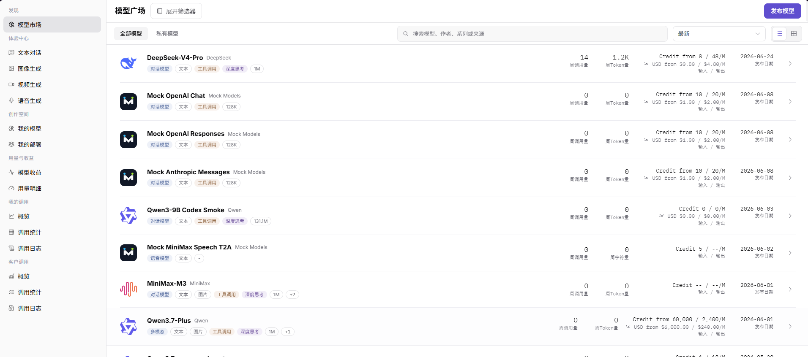
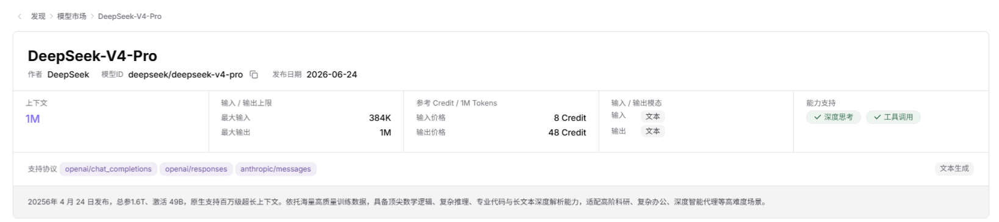
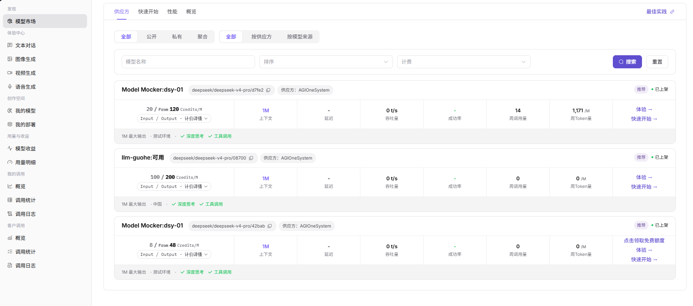
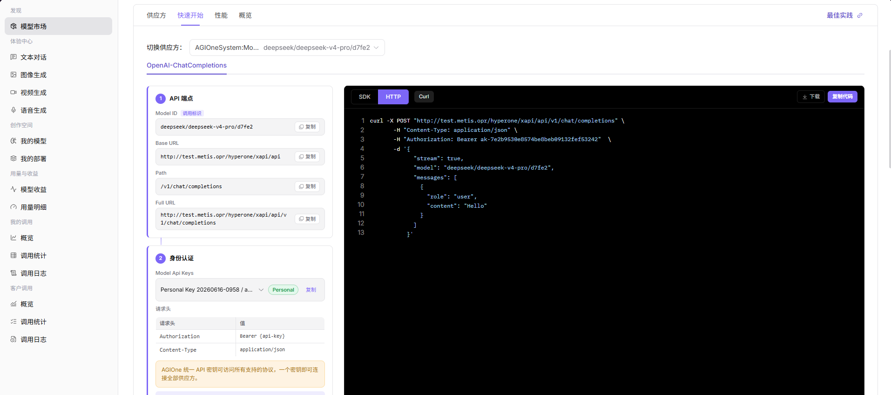
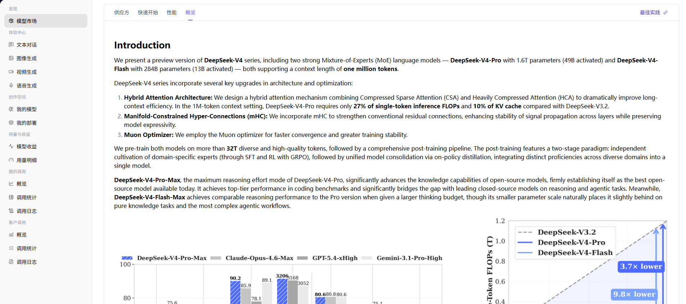

# 模型市场

## 前言

| 项目   | 内容                                       |
| ---- | ---------------------------------------- |
| 适用角色 | 普通用户                                     |
| 导航路径 | 发现 > 模型市场                                 |
| 功能定位 | 用户发现和浏览平台模型的主入口（页面内标题显示为 **"模型广场"**），包含 **列表视图**（筛选/搜索/排序模型）+ **4 个详情子页签**（供应方 / 快速开始 / 性能 / 概览）|

## 页面结构

### 搜索区域

页面顶部提供筛选与搜索工具栏：
- **"全部模型"** / **"私有模型"** Tab 切换模型范围
- 搜索框：输入"模型名、作者、系列或来源"关键字
- 排序下拉（默认 **"最新"**）
- 视图切换按钮（**列表 / 网格**）
- 左侧提供 **"展开筛选器"** 按钮（展开/收起高级筛选：模型类型 / 输入输出能力 / 标签等）

### 操作按钮区

- 页面右上角提供 **"发布模型"** 按钮（紫色），用于提交新模型发布申请
- 每个模型卡片行末提供 **">"** 按钮，点击进入模型详情页

### 数据列表说明

页面以横向 1 列展示模型卡片，每张卡片含：模型图标 + 名称 + 作者 + 能力标签（对话模型 / 文本 / 工具调用 / 深度思考 / 1M 等）+ 周调用量 + 周 Token 量 + 计费标准 + 发布日期。

## 操作步骤

### 查看模型列表

1. 进入平台首页，点击左侧导航栏的 **"发现 > 模型市场"** 菜单，进入"模型广场"页面。
2. 页面顶部提供筛选与搜索工具栏：
   - **"全部模型"** / **"私有模型"** Tab 切换模型范围
   - 搜索框：输入"模型名、作者、系列或来源"关键字
   - 排序下拉（默认 **"最新"**）
   - 视图切换按钮（**列表 / 网格**）
3. 点击 **"展开筛选器"** 按钮可展开/收起高级筛选（模型类型 / 输入输出能力 / 标签等）。
4. 页面右上角 **"发布模型"** 按钮（紫色）用于提交新模型发布申请。
5. 列表展示模型卡片（横向 1 列），每张卡片含：
   - 模型图标 + 名称（如 `DeepSeek-V4-Pro`）+ 作者（如 `DeepSeek`）
   - 能力标签（如 `对话模型 / 文本 / 工具调用 / 深度思考 / 1M`）
   - 周调用量（如 `14`）/ 周 Token 量（如 `1.2K` 或 `1,171/M`）
   - 计费标准（如 `Credit from 8 / 48/M (≈ USD from $0.60 / $4.80/M)`）+ 发布日期（如 `2026-06-24`）
   - 行末 **">"** 按钮进入详情页
6. 点击目标模型行（或名称 / 行末按钮）→ 进入模型详情页（页面顶部为面包屑 **"发现 > 模型市场 > 模型名"**，右上角 **"最佳实践"** 外链）。

#### 参数说明 - 模型列表卡片

| 字段名称 | 字段类型 | 示例 | 说明 |
|----------|----------|------|------|
| 模型名称 | 文本 | `DeepSeek-V4-Pro` | 模型的展示名称 |
| 作者 | 文本 | `DeepSeek` | 模型的作者 / 提供方 |
| 能力标签 | 多标签 | `对话模型 / 文本 / 工具调用 / 深度思考 / 1M` | 模型的功能类型 + 上下文长度 |
| 周调用量 | 数值 | `14` | 本周被调用的次数 |
| 周 Token 量 | 数值 | `1.2K`（对话模型）/ `1,171/M`（Token 总量） | 本周消耗的 Token 总量 |
| 计费标准 | 文本 | `Credit from 8 / 48/M (≈ USD from $0.60 / $4.80/M)` | 模型的输入 / 输出价格（双币种）|
| 发布日期 | 日期 | `2026-06-24` | 模型的发布时间 |

### 查看模型详情（4 个子页签）

详情页顶部为面包屑 **"发现 > 模型市场 > 模型名"**，右上角 **"最佳实践"** 链接（带外链图标）。详情页含 4 个子页签（默认显示 **"供应方"** Tab）。

- **模型元信息卡片**（顶部）：
  - 标题行：模型名称（如 `DeepSeek-V4-Pro`）/ 作者（如 `DeepSeek`）/ **模型 ID**（如 `deepseek/deepseek-v4-pro` 带 **复制** 按钮）/ 发布日期（如 `2026-06-24`）
  - 5 张字段卡：上下文（如 `1M`）/ 输入输出上限（最大输入 384K / 最大输出 1M）/ 参考 Credit（输入 8 / 输出 48 Credit/M）/ 输入输出模态（输入 文本 / 输出 文本）/ 能力支持（✓深度思考 / ✓工具调用 / 文本生成）
  - **支持协议** 标签：openai/chat_completions / openai/responses / anthropic/messages
  - 描述文本：模型发布信息 + 核心特点（如 "2026年4月24日发布，总参1.6T、激活 49B..."）

#### 子页签 1：供应方（默认显示）

- 顶部 **"切换供应方"** 下拉：选择目标供应方实例（如 `AGIOneSystem:Model Mocker deepseek/deepseek-v4-pro/d7fe2`）
- 协议选择：OpenAI-ChatCompletions（当前选中）/ 其他（横向 Tab）
- 双层筛选：全部 / 公开 / 私有 / **聚合** + 全部 / 按供应方 / 按模型来源
- 搜索工具栏：模型名称 + 排序 + 计费 + 搜索 / 重置
- **供应方实例卡片**列表，每张卡片含：
  - 实例名（如 `Model Mocker:dsy-01`）+ 模型 ID（如 `deepseek/deepseek-v4-pro/d7fe2` 带复制按钮）+ 供应方（如 `AGIOneSystem`）
  - 状态徽章：**"推荐"** + **"已上架"**
  - 计费信息：输入/输出 `Credits/M`（如 `20 / From 120`）+ Input/Output · 计费详情
  - 性能指标 6 列：上下文（如 `1M`）/ 延迟（如 `-`）/ 吞吐量（如 `0 t/s`）/ 成功率（如 `-`）/ 周调用量（如 `14`）/ 周 Token 量（如 `1,171/M`）
  - 入口链接：**体验 →** / **快速开始 →** / **点击领取免费额度**（部分实例）
  - 元数据栏：1M 最大输出 · 测试环境/中国 · ✓深度思考 / ✓工具调用

#### 子页签 2：快速开始

顶部：**切换供应方** 下拉。

**OpenAI-ChatCompletions** 协议下的 2 步配置：

- **Step 1：API 端点**（4 个信息块，每块带 **"复制"** 按钮）：
  - **Model ID**（调用标识）：如 `deepseek/deepseek-v4-pro/d7fe2`
  - **Base URL**：如 `http://test.metis.opr/hyperone/xapi/api`
  - **Path**：如 `/v1/chat/completions`
  - **Full URL**：如 `http://test.metis.opr/hyperone/xapi/api/v1/chat/completions`

- **Step 2：身份认证**：
  - **Model Api Keys** 下拉：选择 Personal Key（如 `20260616-0958 / a...` 带 **"Personal"** 绿标），可复制
  - **请求头** 表格（2 列：请求头 / 值）：
    - Authorization: `Bearer {api-key}`
    - Content-Type: `application/json`
  - 提示信息：**"AGIOne 统一 API 密钥可访问所有支持的协议，一个密钥可连接全部供应方。"**

页面右侧为**代码示例区**（**SDK / HTTP / Curl** 3 个 Tab，默认 HTTP 紫色高亮），含 3 个操作按钮：**下载** / **复制代码**，下方为带行号的代码展示窗。

#### 子页签 3：性能

- **选择时间** 范围选择器（如 `2026-06-17 00:00:00 - 2026-06-23 15:07:00`）
- **数据粒度** 按钮（紫色，当前 **"天"**）
- 4 个图表卡片（2×2 网格，含图例多线对比）：
  - **平均请求耗时**（ms）
  - **平均首 Token 延迟**（ms）
  - **实时请求频次**
  - **请求成功率**（%）

#### 子页签 4：概览

- **Introduction** 段（英文富文本）：模型介绍 + 3 个编号要点（架构升级：Hybrid Attention Architecture / Manifold-Constrained Hyper-Connections (mHC) / Muon Optimizer）+ 训练数据规模（**32T** tokens）+ 子版本介绍（DeepSeek-V4-Pro-Max / DeepSeek-V4-Flash-Max）
- **性能对比图表**：
  - 横向柱状图：DeepSeek-V4-Pro-Max vs Claude-Opus-4.6-Max vs GPT-5.4-xHigh vs Gemini-3.1-Pro-High（多模型基准对比）
  - 折线图：DeepSeek-V3.2 vs DeepSeek-V4-Pro vs DeepSeek-V4-Flash（标注 **3.7× lower** / **9.8× lower** 关键性能指标）

#### 参数说明 - 模型详情页 4 个子页签

| 字段名称 | 字段类型 | 示例 | 说明 |
|----------|----------|------|------|
| 供应方 - 模型名称 | 文本 | `DeepSeek-V4-Pro` | 详情页标题 |
| 供应方 - 作者 | 文本 | `DeepSeek` | 模型作者 |
| 供应方 - 模型 ID | 文本 | `deepseek/deepseek-v4-pro` | 唯一标识（带复制）|
| 供应方 - 发布日期 | 日期 | `2026-06-24` | 发布时间 |
| 供应方 - 上下文 | 数值 | `1M` | 最大上下文窗口 |
| 供应方 - 输入上限 | 数值 | `384K` | 单次输入 Token 上限 |
| 供应方 - 输出上限 | 数值 | `1M` | 单次输出 Token 上限 |
| 供应方 - 输入价格 | 数值 | `8 Credit / 1M Tokens` | 输入参考价 |
| 供应方 - 输出价格 | 数值 | `48 Credit / 1M Tokens` | 输出参考价 |
| 供应方 - 输入模态 | 多选 | `文本` | 支持的输入数据类型 |
| 供应方 - 输出模态 | 多选 | `文本` | 支持的输出数据类型 |
| 供应方 - 能力支持 | 开关标签 | `✓深度思考 / ✓工具调用 / 文本生成` | 模型扩展能力 |
| 供应方 - 支持协议 | 标签 | `openai/chat_completions / openai/responses / anthropic/messages` | 兼容的 API 协议 |
| 供应方 - 实例名 | 文本 | `Model Mocker:dsy-01` | 供应方下的具体实例 |
| 供应方 - 状态徽章 | 标签 | `推荐 / 已上架` | 实例的展示状态 |
| 供应方 - 计费 | 数值 | `20 / From 120 Credits/M` | 实例的输入 / 输出价 |
| 供应方 - 周调用量 | 数值 | `14` | 实例的实时调用量 |
| 供应方 - 周 Token 量 | 数值 | `1,171/M` | 实例的实时 Token 消耗 |
| 快速开始 - Model ID | 文本 | `deepseek/deepseek-v4-pro/d7fe2` | API 调用的精确模型标识 |
| 快速开始 - Base URL | URL | `http://test.metis.opr/hyperone/xapi/api` | API 服务地址 |
| 快速开始 - Path | 路径 | `/v1/chat/completions` | 接口路径 |
| 快速开始 - Full URL | URL | 上述拼接 | 完整调用端点 |
| 快速开始 - API Key | 文本 | `Personal Key 20260616-0958` | 认证密钥（Personal 类型）|
| 快速开始 - 请求头 | 键值对 | `Authorization: Bearer {api-key}` / `Content-Type: application/json` | HTTP 请求头（必填）|
| 快速开始 - 代码示例 | 多 Tab | SDK / HTTP / Curl | 3 种调用代码示例 |
| 性能 - 时间范围 | 日期范围 | `2026-06-17 ~ 2026-06-23` | 性能数据的时间窗口 |
| 性能 - 数据粒度 | 按钮 | `天 / 小时 / 分钟` | 时间聚合粒度 |
| 性能 - 指标 | 图表 | 4 个折线图 | 平均请求耗时 / 首Token延迟 / 实时请求频次 / 请求成功率 |
| 概览 - 介绍 | 富文本 | Introduction 段 | 模型的完整介绍 + 架构升级要点 |
| 概览 - 性能对比 | 图表 | 柱状图 + 折线图 | 与其他模型的性能基准对比 |

## 其他操作

| 操作名称 | 操作步骤 |
|----------|----------|
| 筛选模型范围 | 顶部 **"全部模型"** / **"私有模型"** Tab 切换 → 过滤模型列表 |
| 搜索模型 | 在搜索框输入"模型名、作者、系列或来源"关键字 → 系统实时过滤匹配的模型 |
| 排序模型 | 点击排序下拉（**最新 / 最热 / 按周调用量** 等）→ 列表按选定规则重新排序 |
| 展开高级筛选 | 点击 **"展开筛选器"** 按钮 → 按模型类型 / 输入输出能力 / 标签等条件筛选 |
| 切换列表/网格视图 | 点击视图切换按钮 → 列表 / 网格切换 |
| 发布模型 | 点击页面右上角 **"发布模型"** 按钮 → 进入发布流程（详见 [发布模型](../publisher-quick-guide)）|
| 查看供应方实例 | 详情页 **"供应方"** Tab → **"切换供应方"** 下拉选择 → 卡片含 计费 / 性能 / 入口链接 |
| 体验模型 | 在供应方实例卡片，点击 **"体验 →"** 按钮 → 进入体验中心试用 |
| 领取免费额度 | 在供应方实例卡片，点击 **"点击领取免费额度"** 按钮 → 领取免费试用 Credit（部分实例）|
| 进入快速开始 | 在供应方实例卡片，点击 **"快速开始 →"** 按钮 → 跳转详情页 **"快速开始"** Tab |
| 复制 API 端点 | 详情页 **"快速开始"** Tab → Step 1 API 端点区域 → 点击对应字段的 **"复制"** 按钮 |
| 切换调用代码语言 | 详情页 **"快速开始"** Tab → 右侧代码区 → 选择 **SDK / HTTP / Curl** Tab |
| 下载代码 | 详情页 **"快速开始"** Tab → 右侧代码区 → 点击 **"下载"** 按钮 |
| 复制完整调用 | 详情页 **"快速开始"** Tab → 右侧代码区 → 点击 **"复制代码"** 按钮 |
| 查看性能数据 | 详情页 **"性能"** Tab → 选择时间范围 + 数据粒度 → 查看 4 个指标的折线图 |
| 查看模型概览 | 详情页 **"概览"** Tab → 查看 Introduction 富文本 + 性能对比图表 |
| 查看最佳实践 | 详情页右上角 → 点击 **"最佳实践"** 链接（带外链图标）→ 跳转文档 |

## 注意事项

- **菜单 vs 页面标题**：菜单中显示 **"模型市场"**（英文 Models），页面内标题显示 **"模型广场"**，两者指代同一功能。
- **私有模型**：通过 **"私有模型"** Tab 过滤的模型仅对当前租户可见，与 **"全部模型"** Tab 中的公开模型区分。
- **多供应方机制**：同一模型可被多个供应方部署（如 `DeepSeek-V4-Pro` 有 `Model Mocker:dsy-01` / `llm-guohe:可用` / `Model Mocker:dsy-01` 三种实例），不同供应方有不同的计费、性能和地域。
- **推荐 vs 普通实例**：带 **"推荐"** 标签的供应方实例为平台推荐，通常有更优的性能/价格组合。
- **计费显示**：列表卡片同时显示 **Credit 价** 和 **USD 价**（约值），Credit 是平台统一计费单位，USD 为参考汇率。
- **已上架 / 测试环境**：**"已上架"** 徽章表示该供应方实例已通过审核可调用；地域信息（如 **"中国"** / **"测试环境"**）标识数据合规区域。
- **免费额度**：部分供应方实例提供 **"点击领取免费额度"** 入口，用户可领取试用 Credit 进行模型体验。
- **API 密钥统一**：使用 **"快速开始"** Tab 提供的 Personal Key 可访问所有支持的协议（OpenAI-ChatCompletions / OpenAI-Responses / Anthropic-Messages 等），无需为不同协议申请不同密钥。
- **性能数据延迟**：性能 Tab 展示历史数据，新部署的供应方实例可能暂无数据。
- **多卡片不同实例**：同一模型名 + 不同供应方实例 = 不同 Model ID（如 `deepseek-v4-pro/d7fe2` / `deepseek-v4-pro/08700` / `deepseek-v4-pro/42bab`），调用时需使用精确的 Model ID。
