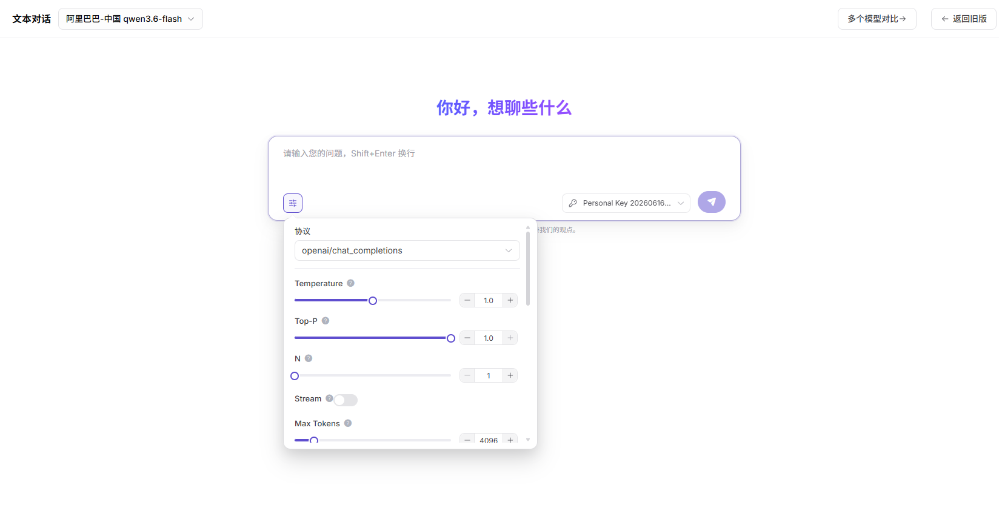

# 文本对话

## 前言

| 项目 | 内容 |
|------|------|
| 适用角色 | 普通用户 |
| 导航路径 | 体验中心 > 文本对话 |
| 功能定位 | 通过文本输入与 AI 模型交互，体验模型的问答、生成和多轮对话能力 |

## 页面结构

### 搜索区域

主页面无搜索区域；「选择模型」弹窗左侧提供模型名称 / 模型标识搜索框。

### 操作按钮区

* 顶部模型下拉框用于查看当前模型并打开「选择模型」弹窗
* 右上角提供「多个模型对比」和「返回旧版」按钮
* 对话输入框左下角提供参数配置按钮，可展开协议和生成参数
* 对话输入框右下角提供调用密钥选择和发送按钮

### 数据列表说明

页面中央展示欢迎语、历史对话记录、用户输入内容和模型回复内容。

## 操作步骤

### 模型生成文本

1. 进入平台首页，点击左侧导航栏的 **"体验中心 > 文本对话"** 菜单，进入对话体验页面。
2. 点击顶部模型下拉框，打开「选择模型」弹窗：
   - 可在左侧搜索框输入模型名称或模型标识进行筛选；
   - 在左侧模型列表中选择目标模型；
   - 在右侧供应方区域选择可用供应方实例；
   - 点击「确定」完成模型切换。

3. 点击输入框左下角的参数配置按钮，设置对话参数：
   - 选择 **协议**（如 openai/chat_completions）；
   - 调整 **Temperature**、**Top-P**、**N**、**Stream**、**Max Tokens** 等生成参数。

4. 如需指定调用凭证，在输入框右下角选择对应的 **Personal Key**。
5. 在对话输入框中输入问题，点击发送按钮即可与模型对话，支持使用 Shift+Enter 换行输入。

#### 参数说明（参数配置面板）

| 字段名称 | 字段类型 | 示例 | 说明 |
|----------|----------|------|------|
| 协议 | 下拉选择 | `openai/chat_completions` | 模型调用的 API 协议 |
| Temperature | 数值滑块 / 输入框 | `1.0` | 控制回复随机性，值越高回复越发散 |
| Top-P | 数值滑块 / 输入框 | `1.0` | 控制候选词采样范围，值越高可选范围越大 |
| N | 数值滑块 / 输入框 | `1` | 单次请求返回的候选回复数量 |
| Stream | 开关 | `关闭` | 是否以流式方式返回模型回复 |
| Max Tokens | 数值滑块 / 输入框 | `4096` | 限制单次回复可生成的最大 Token 数 |
| Personal Key | 下拉选择 | `Personal Key 20260616...` | 当前请求使用的调用凭证 |

#### 参数说明（模型选择弹窗）

| 字段名称 | 字段类型 | 示例 | 说明 |
|----------|----------|------|------|
| 模型名称 / 标识 | 文本 | `qwen3.6-flash / qwen/qwen3.6-flash` | 模型的名称与唯一标识 |
| 发布日期 | 日期 | `2026-04-16` | 模型的发布时间 |
| 上下文长度 | 数值 | `1M` | 模型支持的最大上下文窗口 |
| 输入 / 输出 Credit | 数值 | `12 Credit / 72 Credit` | 每 1M Tokens 的输入和输出计费标准 |
| 供应方 | 文本 | `阿里巴巴-中国 / AGIOneSystem` | 模型的供应方及服务实例 |
| 最大输出 | 数值 | `64K` | 该供应方实例支持的最大输出长度 |
| 地域 | 文本 | `中国` | 供应方实例所在地域 |
| 延迟 / 吞吐量 / 成功率 | 数值 | `- / 0 t/s / -` | 供应方实例的运行指标 |
| 周调用量 / 周 Token 量 | 数值 | `0 / 0 M Tokens` | 该供应方实例的近期使用情况 |
| 状态标签 | 标签 | `推荐 / 已上架` | 模型或供应方实例的推荐和上架状态 |
| 能力标签 | 标签 | `深度思考 / 工具调用` | 模型支持的扩展能力 |

## 其他操作

| 操作名称 | 操作步骤 |
|----------|----------|
| 切换模型 | 点击顶部模型下拉框 → 在弹窗中选择不同模型或供应方 → 点击「确定」 |
| 搜索模型 | 在「选择模型」弹窗左侧搜索框输入模型名称或模型标识，快速定位目标模型 |
| 调整参数 | 点击输入框左下角参数配置按钮 → 修改协议、Temperature、Top-P、N、Stream、Max Tokens 等参数 |
| 选择调用密钥 | 点击输入框右下角密钥下拉框，选择本次请求使用的 Personal Key |
| 多个模型对比 | 点击「多个模型对比」按钮，进入多模型并行对话体验页面 |
| 对话输入 | 在底部输入框输入问题，按发送按钮或 Enter 发送；使用 Shift+Enter 换行 |
| 查看对话历史 | 在对话窗口中查看历史对话记录 |
| 返回旧版 | 点击「返回旧版」按钮，切换到旧版文本对话页面 |

## 注意事项

* Temperature 和 Top-P 会影响回复发散程度，参数越高，回复通常越随机。
* Max Tokens 不能超过所选模型和供应方实例支持的输出限制。
* Stream 是否可用取决于所选协议、模型和供应方实例能力。
* 模型价格、状态、地域和性能指标以「选择模型」弹窗中展示的信息为准。
* 使用 Shift+Enter 可以换行输入，避免发送不完整的句子。
* 可点击「多个模型对比」按钮进入多模型并行对话体验页面。
