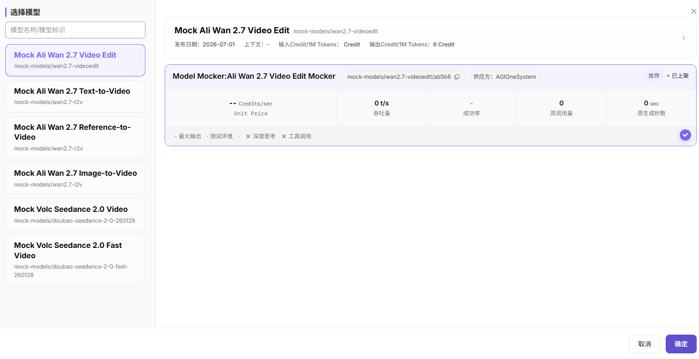

# 视频生成

## 前言

| 项目 | 内容 |
|------|------|
| 适用角色 | 普通用户 |
| 导航路径 | 体验中心 > 视频生成 |
| 功能定位 | 通过文本描述或参考素材生成 AI 视频，体验模型的视频生成能力 |

## 页面结构

### 搜索区域

主页面无搜索区域；「选择模型」弹窗左侧提供模型名称 / 模型标识搜索框。

### 操作按钮区

* 顶部模型下拉框用于查看当前视频模型并打开「选择模型」弹窗
* 右上角提供「多个模型对比」和「返回旧版」按钮
* 输入框左侧提供素材添加入口，可添加视频生成所需的参考素材
* 输入框左下角提供 Resolution、Ratio、Duration 和参数配置按钮
* 输入框右下角提供调用密钥选择和发送按钮

### 数据列表说明

页面中央展示视频生成提示区、提示词输入框、参数配置入口和生成结果区域。

## 操作步骤

### 模型生成视频

1. 进入平台首页，点击左侧导航栏的 **"体验中心 > 视频生成"** 菜单，进入视频生成体验页面。
2. 点击顶部模型下拉框，打开「选择模型」弹窗：
   - 可在左侧搜索框输入模型名称或模型标识进行筛选；
   - 在左侧模型列表中选择目标视频模型；
   - 在右侧供应方区域选择可用供应方实例；
   - 点击「确定」完成模型切换。

3. 如当前模型需要参考素材，点击输入框左侧的添加入口上传或选择素材。
4. 在输入框左下角设置基础生成选项：
   - 选择 **Resolution**，设置输出视频分辨率；
   - 选择 **Ratio**，设置输出视频宽高比；
   - 设置 **Duration**，控制生成视频时长。
5. 点击参数配置按钮，设置高级参数：
   - 选择 **协议**（如 openai/video）；
   - 填写 **Negative Prompt**，说明不希望出现在视频中的内容；
   - 设置 **Audio Setting**；
   - 按需开启或关闭 **Prompt Extend**；
   - 按需开启或关闭 **Watermark**；
   - 按需填写 **Seed**。

6. 如需指定调用凭证，在输入框右下角选择对应的 **Personal Key**。
7. 在输入框中描述想生成的视频，点击发送按钮生成视频。
8. 生成完成后，在页面结果区域查看生成的视频。

#### 参数说明（参数配置面板）

| 字段名称 | 字段类型 | 示例 | 说明 |
|----------|----------|------|------|
| 参考素材 | 上传 / 添加入口 | `+` | 根据所选模型添加图片或视频等参考素材 |
| Resolution | 快捷选项 | `1080P` | 输出视频的分辨率 |
| Ratio | 快捷选项 | `--` | 输出视频的宽高比，具体可选项取决于所选模型 |
| Duration | 数值选项 | `0` | 生成视频的时长 |
| 协议 | 下拉选择 | `openai/video` | 模型调用的 API 协议 |
| Negative Prompt | 文本输入 | `please input` | 负向提示词，用于描述不希望生成的内容 |
| Audio Setting | 下拉选择 | `auto` | 生成视频的音频配置 |
| Prompt Extend | 开关 | `关闭` | 是否自动扩展提示词 |
| Watermark | 开关 | `关闭` | 是否为生成视频添加水印 |
| Seed | 数值输入 | `按需填写` | 生成随机种子，用于控制生成结果的可复现性 |
| Personal Key | 下拉选择 | `Personal Key 20260616...` | 当前请求使用的调用凭证 |
| 提示词 | 文本输入 | `请输入您的问题` | 输入框中的视频生成描述 |

#### 参数说明（模型选择弹窗）

| 字段名称 | 字段类型 | 示例 | 说明 |
|----------|----------|------|------|
| 模型名称 / 标识 | 文本 | `Mock Ali Wan 2.7 Video Edit / mock-models/wan2.7-videoedit` | 模型的名称与唯一标识 |
| 发布日期 | 日期 | `2026-07-01` | 模型的发布时间 |
| 上下文长度 | 文本 | `-` | 视频模型的上下文长度展示值 |
| 输入 / 输出 Credit | 数值 | `- Credit / 6 Credit` | 模型输入和输出侧的计费展示 |
| 供应方 | 文本 | `Model Mocker:Ali Wan 2.7 Video Edit Mocker / AGIOneSystem` | 模型的供应方及服务实例 |
| 计费单位 | 文本 | `Credits/sec` | 当前供应方实例的计费方式 |
| 单价 | 数值 | `-- Credits/sec` | 按生成秒数计费的单价展示 |
| 吞吐量 / 成功率 | 数值 | `0 t/s / -` | 供应方实例的运行指标 |
| 周调用量 / 周生成秒数 | 数值 | `0 / 0 sec` | 该供应方实例的近期使用情况 |
| 状态标签 | 标签 | `推荐 / 已上架` | 模型或供应方实例的推荐和上架状态 |
| 能力标签 | 标签 | `深度思考 / 工具调用` | 模型能力标签；截图中均为不支持状态 |

## 其他操作

| 操作名称 | 操作步骤 |
|----------|----------|
| 切换模型 | 点击顶部模型下拉框 → 在弹窗中选择不同模型或供应方 → 点击「确定」 |
| 搜索模型 | 在「选择模型」弹窗左侧搜索框输入模型名称或模型标识，快速定位目标模型 |
| 添加参考素材 | 点击输入框左侧的添加入口，按所选模型要求添加图片或视频素材 |
| 调整基础参数 | 在输入框左下角修改 Resolution、Ratio 或 Duration |
| 调整高级参数 | 点击输入框左下角参数配置按钮 → 修改协议、Negative Prompt、Audio Setting、Prompt Extend、Watermark、Seed 等参数 |
| 选择调用密钥 | 点击输入框右下角密钥下拉框，选择本次请求使用的 Personal Key |
| 多个模型对比 | 点击「多个模型对比」按钮，进入多模型并行视频生成体验页面 |
| 文本输入 | 在底部输入框输入视频描述，按发送按钮或 Enter 发送；使用 Shift+Enter 换行 |
| 返回旧版 | 点击「返回旧版」按钮，切换到旧版视频生成页面 |

## 注意事项

* 视频描述越清晰，生成结果通常越接近预期。
* 参考素材是否必填取决于所选模型类型，例如视频编辑、图生视频、参考视频或文生视频模型要求不同。
* Resolution、Ratio 和 Duration 会影响生成耗时和计费，请按实际需要设置。
* Audio Setting、Prompt Extend、Watermark 和 Seed 的可用性取决于所选协议、模型和供应方实例能力。
* 模型价格、状态、计费单位和性能指标以「选择模型」弹窗中展示的信息为准。
* 可点击「多个模型对比」按钮进入多模型并行视频生成体验页面。
