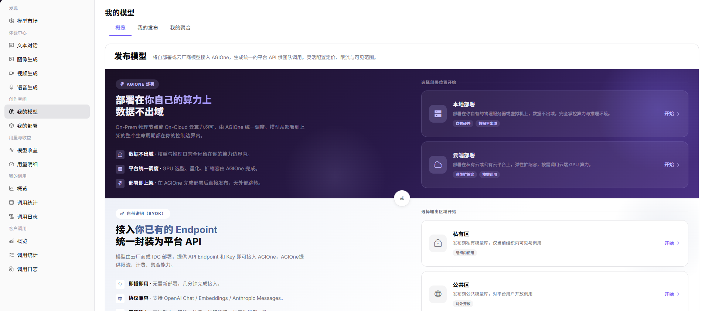
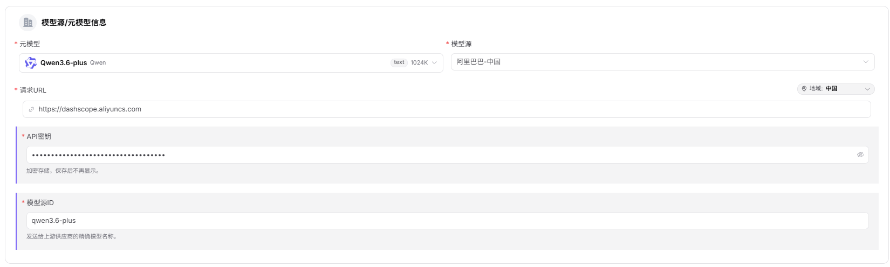
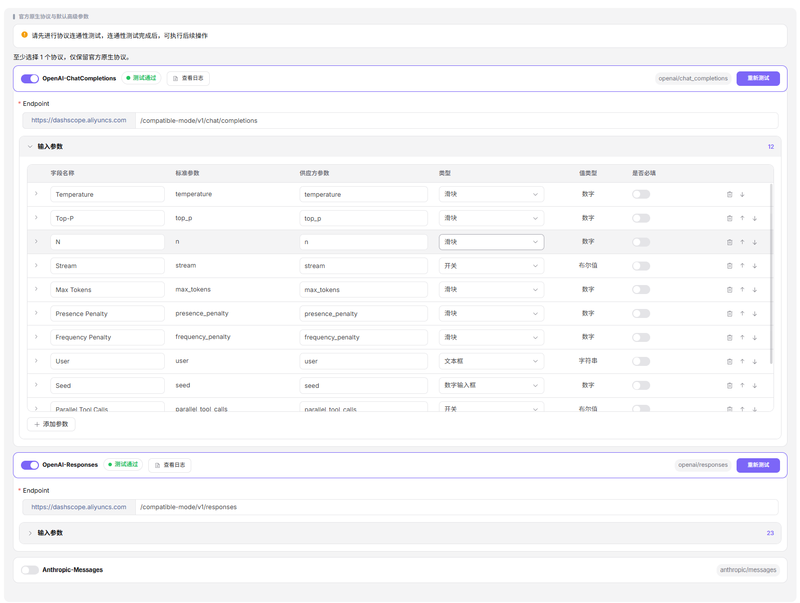
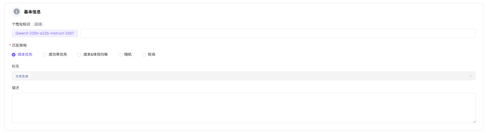
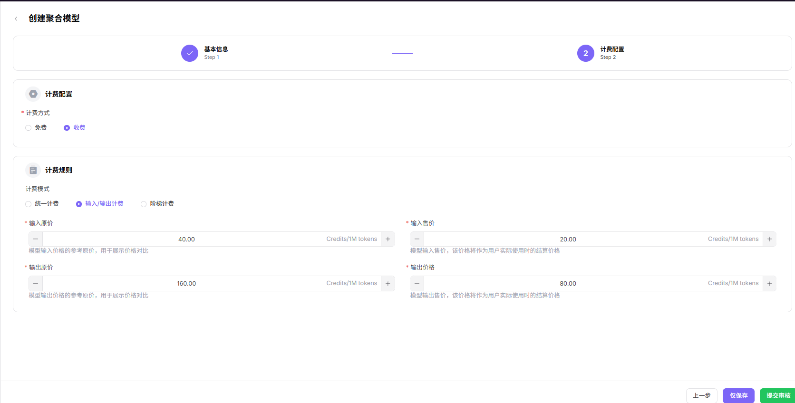

# 我的模型

## 前言

| 项目 | 内容 |
|------|------|
| 适用角色 | 供应方、普通用户 |
| 导航路径 | 创作空间 > 我的模型 |
| 功能定位 | 管理和发布自有模型，支持 AGIOne 托管部署、第三方 BYOK 接入及多模型聚合 |

## 页面结构

### 搜索区域

页面顶部支持按公共 / 私有模型、模型名称、模型类型进行多维度筛选。

### 操作按钮区

- 页面右上角提供 **"发布模型"** 按钮。
- **"我的聚合"** 标签页提供 **"创建聚合模型"** 按钮。
- 每个模型提供详情、编辑、上架 / 下架、删除操作。

### 数据列表说明

页面分为 **"概览"**、**"我的发布"**、**"我的聚合"** 三个标签页，分别展示模型接入发布总入口、已发布的单实例模型、已创建的聚合模型。

### Tab 切换说明

- **"概览"** Tab：模型接入与发布的统一入口，提供全场景的模型部署与接入方案，支持平台托管部署、第三方服务接入及多模型聚合三类核心能力。
- **"我的发布"** Tab：所有单实例发布模型的统一管理视图，可通过顶部 **"公共模型 / 私有模型"** 切换查看不同区域的模型。
- **"我的聚合"** Tab：聚合模型的专属管理视图，可通过顶部 **"公共模型 / 私有模型"** 切换查看不同区域的聚合模型。

## 操作步骤

### 发布模型（多模态模型）

1. 进入平台首页，点击左侧导航栏的 **"创作空间 > 我的模型"** 菜单，进入模型管理页面。
2. 默认进入 **"概览"** Tab，换至 **"我的发布"** Tab，可通过页面顶部 **"公共模型 / 私有模型"** 切换查看不同区域的模型；也可切换至 **"我的聚合"** Tab。

3. 点击页面右上角的 **"发布模型"** 按钮，弹出"选择发布区域"对话框。
4. 选择发布区域：
   - **"发布到私有区"**：仅本团队或租户内可见可调用，加入私有库，不进入公开目录，适合内部业务与安全敏感场景；
   - **"发布到公有区"**：上架公有目录，对所有租户的 EU 开放调用，可独立设置定价与限流。
5. 点击  **"发布到公有区"** 进入发布配置流程（Step 1：基本信息）。

#### **Step 1：基本信息**
- **模型源/元模型信息**：
    - 选择 **"元模型"**（如 Qwen3.6-plus）；
    - 选择 **"模型源"**（如 阿里巴巴-中国）；
    - 填写 **"请求URL"**（如 `https://dashscope.aliyuncs.com`，区域默认"中国"）；
    - 填写 **"API密钥"**（如 `sk-***`）；
    - 填写 **"模型源ID"**（如 `qwen3.6-plus`，即发往上游厂商的精确模型名称）。

- **模型类型**：在"模型类型"区块默认 **"对话模型"**。

- **请求头配置**：认证字段默认为 `Authorization: Bearer <key>`，可点击 **"添加请求头"** 增加自定义字段。

- **模型参数配置**：
    - 默认 **"输入模态"**（文本 / 图片 / 视频）；
    - 默认 **"输出模态"**（文本）；
    - 开启 **"高级能力"**：函数/工具支持、思考模式。
    - **Token 限制**：设置 **"最大上下文"**（如 1024K）、**"最大输入"**（如 991K）、**"最大输出"**（如 64K）。

- **支持协议与默认参数**：至少选择一个协议（OpenAI-ChatCompletions / OpenAI-Responses / Anthropic-Messages），只有先进行协议连通性测试，连通性测试成功后可执行后续操作；测试通过后填写 **"Endpoint"**（如 `https://dashscope.aliyuncs.com/compatible-mode/v1/chat/completions`）并配置 **"输入参数"**（Temperature、Top-P、N、Stream、Max Tokens、Presence Penalty、Frequency Penalty、User、Seed、Parallel Tool Calls 等）。

- **基本信息**：
   - 填写 **"个性化标识"**（如 Qwen3.6-plus）、**"描述"**。

   - **发布方式**：选择 **"立即发布"** 或 **"定时发布"**。

- 点击 **"下一步"** 进入 Step 2：计费配置。

#### **Step 2：计费配置**：
- **计费配置**：
    - 选择 **"计费方式"**：
        -  **"按Token计费"**（按消耗的 Token 计费，Credit / M tokens）
        -  **"免费"**（向所有用户免费开放，不计费，常用于公测/开源/推广/尝鲜）；
- **计费规则**：
    - 开启 **"显示价格对比"** 开关后可展示划线原价；
    - 在 **"计费规则 — 价格录入"** 区块设置：
        - 可启用 **"按上下文长度分阶梯"**（长上下文区间使用更高单价）；
        - 开启 **"缓存命中独立计价"**（命中缓存的输入按独立的 per-M 单价结算）；
        - **设置阶梯价格**：为每个阶梯（如阶梯1: 0K – 256K Tokens、阶梯2: 256K – ∞）分别设置 **"输入售价 / 输出售价 / 缓存命中售价"** 与 **"输入划线原价 / 输出划线原价 / 缓存命中划线原价"**（单位均为 Credits/1M tokens），可点击 **"添加阶梯"** 增加更多区间；
    - **联网搜索**：可开启 WebSearch 工具费用；
    - **免费额度**：开启后可设置可领取额度、人数、总量；

- 点击 **"下一步"** 进入 Step 3：限流配置。

#### **Step 3：限流配置**：
- 选择 **"是否启用限流"**：**"启用限流"** 或 **"不启用"**；
- 设置 **"默认限流"**：
    - **"RPM（每分钟请求数）"**：输入数值（如 2 次/分钟），可勾选 **"不限制"**；
    - **"TPM（每分钟Token数）"**：输入数值（如 100 Token/分钟），可勾选 **"不限制"**。

- 点击 **"仅保存"** 或 **"提交审核"** 完成发布。

#### 参数说明 - 发布流程配置项

| 字段名称           | 字段类型     | 示例                                                                                                                         | 说明                                             |
| -------------- | -------- | -------------------------------------------------------------------------------------------------------------------------- | ---------------------------------------------- |
| 元模型            | 下拉选择     | `Qwen3.6-plus`（含 text 1024K 标签）                                                                                            | 必填，选择基础元模型                                     |
| 模型源            | 下拉选择     | `阿里巴巴-中国`                                                                                                                  | 必填，模型的来源渠道                                     |
| 请求URL          | URL      | `https://dashscope.aliyuncs.com`                                                                                           | 必填，模型服务的 API 地址（可切换区域）                         |
| API密钥          | 文本       | `sk-***`                                                                                                                   | 必填，调用模型的密钥                                     |
| 模型源ID          | 文本       | `qwen3.6-plus`                                                                                                             | 必填，发往上游厂商的精确模型名称                               |
| 模型类型           | 单选       | `对话模型`                                                                                                                     | 必填，模型的功能类型                                     |
| 请求头            | 键值对      | `Authorization: Bearer <key>`                                                                                              | 选填，认证与自定义请求头                                   |
| 输入模态           | 多选       | `文本 / 图片 / 视频`                                                                                                             | 必填，模型支持的输入数据类型                                 |
| 输出模态           | 多选       | `文本`                                                                                                                       | 必填，模型支持的输出数据类型                                 |
| 高级能力           | 开关       | `函数/工具支持 / 思考模式`                                                                                                           | 选填，模型的扩展能力                                     |
| 最大上下文          | 数值       | `1024K`                                                                                                                    | 必填，Token 上下文上限                                 |
| 最大输入           | 数值       | `991K`                                                                                                                     | 必填，单次输入 Token 上限                               |
| 最大输出           | 数值       | `64K`                                                                                                                      | 必填，单次输出 Token 上限                               |
| 支持协议           | 多选       | `OpenAI-ChatCompletions / OpenAI-Responses / Anthropic-Messages`                                                           | 必填，模型兼容的 API 协议，需先进行连通性测试                      |
| Endpoint       | URL      | `https://dashscope.aliyuncs.com/compatible-mode/v1/chat/completions`                                                       | 必填，协议对应的端点地址                                   |
| 输入参数           | 参数列表     | `Temperature / Top-P / N / Stream / Max Tokens / Presence Penalty / Frequency Penalty / User / Seed / Parallel Tool Calls` | 选填，按协议预设的输入参数                                  |
| 个性化标识          | 文本       | `Qwen3.6-plus`                                                                                                             | 必填，模型对外展示的自定义标识                                |
| 描述             | 文本       | `Qwen3.6原生视觉...`                                                                                                           | 选填，模型的说明描述                                     |
| 发布方式           | 单选       | `立即发布 / 定时发布`                                                                                                              | 必填，模型的上线时机                                     |
| 计费方式           | 单选       | `按Token计费 / 免费`                                                                                                            | 必填，模型的收费方式                                     |
| 按上下文长度分阶梯      | 开关       | `开启 / 关闭`                                                                                                                  | 选填，长上下文区间使用更高单价                                |
| 缓存命中独立计价       | 开关       | `开启 / 关闭`                                                                                                                  | 选填，命中缓存的输入按独立的 per-M 单价结算                      |
| 阶梯价格           | 分组       | `阶梯1 0K–256K：输入20/输出120/缓存2  阶梯2 256K–∞：输入80/输出480/缓存8`                                                                    | 必填，按上下文长度分档的输入/输出/缓存售价与划线原价（Credits/1M tokens） |
| 联网搜索           | 开关       | `开启 / 未启用`                                                                                                                 | 选填，启用 WebSearch 工具费用                           |
| 免费额度           | 开关       | `开启 / 未启用`                                                                                                                 | 选填，配置模型的免费调用额度                                 |
| 是否启用限流         | 单选       | `启用限流 / 不启用`                                                                                                               | 选填，配置模型的调用频率限制                                 |
| RPM（每分钟请求数）    | 数值 / 不限制 | `2 次/分钟`                                                                                                                   | 选填，每分钟请求数上限，可勾选"不限制"                           |
| TPM（每分钟Token数） | 数值 / 不限制 | `100 Token/分钟`                                                                                                             | 选填，每分钟 Token 数上限，可勾选"不限制"                      |

### 添加聚合模型

1. 进入平台首页，点击左侧导航栏的 **"我的模型"** 菜单，进入模型管理页面。
2. 切换至 **"我的聚合"** Tab，可通过页面顶部 **"公共模型 / 私有模型"** 切换查看不同区域的聚合模型。
3. 点击页面右上角的 **"创建聚合模型"** 按钮，弹出"选择发布区域"对话框。
4. 选择发布区域：
   - **"发布到私有区"**：仅本团队或租户内可见可调用，加入私有库，不进入公开目录；
   - **"发布到公有区"**：上架公有目录，对所有租户的 EU 开放调用，可独立设置定价与限流。
5. 点击  **"发布到公有区"** 进入发布配置流程（Step 1：基本信息）。

#### **Step 1：基本信息**
- 选择 **"模型类型"**（多模态 / 对话模型 / 图片模型 / 语音模型 / 视频模型 / 嵌入模型 / 重排模型）；
- 选择 **"模型子类型"**（如 LLM）。

- **模型选择**：在"模型选择"列表中点击 **"添加模型"** 按钮，弹出"选择模型"对话框：
   - 左侧为 **模型名称/模型标识** 列表，可输入关键字快速过滤；
   - 右侧展示该模型下的多个供应方实例（含 发布日期、上下文、输入/输出 Credit/1M Tokens、吞吐量、成功率、周调用量、周 Token 量、最大输出、地区、能力标签等指标）；
   - 勾选目标供应方实例（可多选，列表头有 **"全选"**），点击 **"确定"** 完成添加。

- **配置成员模型参数**：为每个添加的成员模型配置：
   - **是否启用**：开关控制；
   - **最低成功率**：百分比（如 80%）；
   - **最高并发率**：数值（如 1500）；
   - **上下文最大长度**：数值（如 128K）；
   - **成本**：分别设置 输入 Token 成本、输出 Token 成本；
   - 点击 **"删除"** 移除该成员模型。

- **基本信息**：
   - 填写 **"个性化标识"**（如 Qwen3-235b-a22b-instruct-2507）；
   - 选择 **"匹配策略"**：**"成本优先"** / **"成功率优先"** / **"成本&体验均衡"** / **"随机"** / **"轮询"**；
   - 选择 **"标签"**（如 文本生成）；
   - 填写 **"描述"**。

- **发布方式**：选择 **"立即发布"** 或 **"定时发布"**。

- 点击 **"下一步"** 进入 Step 2：计费配置。

#### **Step 2：计费配置**
- 选择 **"计费方式"**：**"免费"** 或 **"收费"**；
- 选择 **"计费模式"**：**"统一计费"** / **"输入/输出计费"** / **"阶梯计费"**；
- 设置价格（Credits/1M tokens）：
- **"输入原价"**：模型输入价格的参考原价，用于展示价格对比；
- **"输入售价"**：模型输入售价，该价格将作为用户实际使用时的结算价格；
- **"输出原价"**：模型输出价格的参考原价，用于展示价格对比；
- **"输出价格"**：模型输出售价，该价格将作为用户实际使用时的结算价格。

- 点击 **"仅保存"** 或 **"提交审核"** 完成发布。

#### 参数说明 - 聚合模型配置项

| 字段名称 | 字段类型 | 示例 | 说明 |
|----------|----------|------|------|
| 模型类型 | 单选 | `对话模型 / 图片模型` | 必填，聚合模型的功能类型 |
| 模型子类型 | 下拉选择 | `LLM` | 必填，聚合模型的具体子类型 |
| 成员模型 | 列表选择 | `百度智能云 / 阿里巴巴-中国 等多个供应方实例` | 必填，选择 2 个及以上已发布的模型（多选） |
| 是否启用 | 开关 | `启用 / 关闭` | 必填，控制该成员模型是否参与路由 |
| 最低成功率 | 百分比 | `80%` | 必填，低于该成功率的成员模型将被剔除 |
| 最高并发率 | 数值 | `1500` | 必填，成员模型的最大并发数限制 |
| 上下文最大长度 | 数值 | `128K` | 必填，成员模型支持的上下文上限 |
| 输入 Token 成本 | 数值 | `2000` | 必填，每百万输入 Token 的成本参考 |
| 输出 Token 成本 | 数值 | `8000` | 必填，每百万输出 Token 的成本参考 |
| 个性化标识 | 文本 | `Qwen3-235b-a22b-instruct-2507` | 必填，聚合模型对外展示的自定义标识 |
| 匹配策略 | 单选 | `成本优先 / 成功率优先 / 成本&体验均衡 / 随机 / 轮询` | 必填，模型调用时的路由策略 |
| 标签 | 下拉选择 | `文本生成` | 选填，聚合模型所属标签 |
| 描述 | 文本 | `聚合模型...` | 选填，聚合模型的说明描述 |
| 发布方式 | 单选 | `立即发布 / 定时发布` | 必填，聚合模型的上线时机 |
| 计费方式 | 单选 | `免费 / 收费` | 必填，聚合模型的收费方式 |
| 计费模式 | 单选 | `统一计费 / 输入/输出计费 / 阶梯计费` | 必填，收费时的计价方式 |
| 输入原价 | 数值 | `40.00 Credits/1M tokens` | 选填，模型输入价格的参考原价，用于展示价格对比 |
| 输入售价 | 数值 | `20.00 Credits/1M tokens` | 必填，模型输入售价，作为用户实际使用时的结算价格 |
| 输出原价 | 数值 | `160.00 Credits/1M tokens` | 选填，模型输出价格的参考原价，用于展示价格对比 |
| 输出价格 | 数值 | `80.00 Credits/1M tokens` | 必填，模型输出售价，作为用户实际使用时的结算价格 |

## 其他操作

| 操作名称     | 操作步骤                                      |
| -------- | ----------------------------------------- |
| 查看详情     | 点击目标模型的「详情」按钮 → 查看完整配置信息 → 点击左上角返回箭头退出    |
| 编辑模型     | 点击目标模型的「编辑」按钮 → 修改配置信息 → 提交审核             |
| 上下架模型    | 点击目标模型的「上架」/「下架」按钮 → 确认状态变更               |
| 删除模型     | 点击目标模型的「删除」按钮 → 删除操作不可逆，请谨慎操作             |
| 查看聚合模型详情 | 点击目标聚合模型的「详情」按钮 → 查看完整配置信息 → 点击左上角返回箭头退出  |
| 编辑聚合模型   | 点击目标聚合模型的「编辑」按钮 → 修改成员模型、路由策略、计费配置 → 提交审核 |
| 上下架聚合模型  | 点击目标聚合模型的「上架」/「下架」按钮 → 确认状态变更             |
| 删除聚合模型   | 点击目标聚合模型的「删除」按钮 → 删除操作不可逆，请谨慎操作           |

## 注意事项

- **删除操作不可逆**，请谨慎操作。
- 聚合模型需要选择至少 2 个已发布的模型作为成员模型。
- 上架模型前请确保配置信息准确，避免影响服务质量。
- 发布模型前需先完成协议连通性测试，否则无法进入后续配置。
