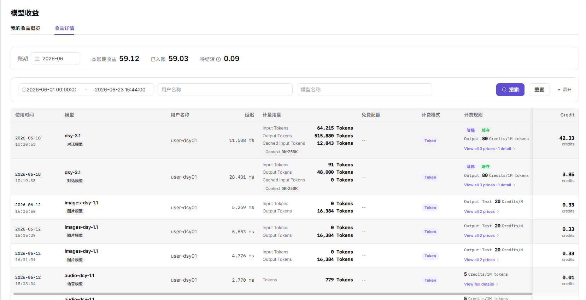

# 模型收益

## 前言

| 项目 | 内容 |
|------|------|
| 适用角色 | 模型提供方（提供模型并获得收益的租户） |
| 导航路径 | 用量与收益 > 模型收益 |
| 功能定位 | 模型提供方查看收益概览与结算详情的入口（英文 UI 标题 Model Earnings），含 **2 个子页签**：**我的收益概览**（默认）+ **收益详情** |

## 页面结构

### 顶部工具栏

页面顶部固定区域提供筛选与查询工具：
- **"我的收益概览" / "收益详情"** Tab 切换（默认 我的收益概览）
- **"数据粒度"** 下拉选择器（默认 **"天"**）
- **"时间范围"** 选择器（默认 `2026-06-01 00:00:00 - 2026-06-23 15:44:00`）

### 我的收益概览（默认 Tab）

页面分 2 大区块：4 个核心指标卡片 + 6 张图表（2×3 网格布局）。

- **4 个核心指标卡片**（每张含迷你折线图 + 较上期环比）：
  - **用户数量**（如 `2`，↓ 0% 较上期）— 统计周期内调用过模型的独立用户数
  - **模型数量**（如 `5`，↓ 0% 较上期）— 统计周期内产生收益的模型数
  - **收入 Tokens**（如 `753,596`，↓ 0% 较上期）— 统计周期内用户调用产生的 Token 总量
  - **收入 Credit**（如 `59.12`，↓ 0% 较上期）— 统计周期内的总收益 Credit
- **6 张图表**（2×3 网格）：
  - **模型收益趋势**（折线图，多线对比）— 按模型类型（对话模型 / 图片模型 / 语音模型 / 视频模型 / 嵌入模型 / 重排模型）统计的收益时间序列
  - **模型收益占比**（环形图）— 不同模型类型对总收益的贡献占比
  - **用户活跃度**（柱状图）— 按日统计的活跃用户数
  - **模型调用次数趋势**（折线图，多线对比）— 按模型实例（如 `dsy002` / `audio-dsy-1.1` / `images-dsy-1.1` / `dsy-3.1` / `dsy001`）统计的调用量时间序列
  - **Credit 消耗排行（TOP10）**（表格）— 按用户维度的 Credit 消耗排行
  - **模型调用次数分布**（环形图）— 不同模型的调用占比

### 收益详情 Tab

页面分 2 段：3 个结算数据卡片 + 9 列收益明细表格。

- **3 个结算数据卡片**（顶部）：
  - **本账期收益**（如 `59.12`）— 当前账期的总收益
  - **已入账**（如 `59.03`）— 已完成结算的收益
  - **待结转 ⊕**（如 `0.09`）— 当前账期暂未结算的收益
- **筛选工具栏**（账期下方）：
  - **"账期"** 选择器（默认 `2026-06`，YYYY-MM 格式）
  - 时间范围（默认锁定为账期内的起止时间）
  - **"用户名称"** / **"模型名称"** 输入框
  - **"搜索"** / **"重置"** / **"展开"** 按钮
- **9 列收益明细表格**（按时间倒序，每行展示一次调用的收益详情）：使用时间 / 模型 / 用户名称 / 延迟 / 计量用量 / 免费配额 / 计费模式 / 计费规则 / Credit

## 操作步骤

### 查看收益概览（我的收益概览 Tab，默认）

1. 进入平台首页，点击左侧导航栏的 **"用量与收益 > 模型收益"** 菜单，默认进入 **"我的收益概览"** Tab。
2. 页面顶部 **"数据粒度"** 选择器（默认 **"天"**）+ **时间范围** 选择器（如 `2026-06-01 00:00:00 - 2026-06-23 15:44:00`）。
3. 查看 **4 个核心指标卡片**（每张卡片下方含迷你折线图 + 较上期环比）：
   - **用户数量**（如 `2`，↓ 0% 较上期）— 统计周期内调用过模型的独立用户数
   - **模型数量**（如 `5`，↓ 0% 较上期）— 统计周期内产生收益的模型数
   - **收入 Tokens**（如 `753,596`，↓ 0% 较上期）— 统计周期内用户调用产生的 Token 总量
   - **收入 Credit**（如 `59.12`，↓ 0% 较上期）— 统计周期内的总收益 Credit
4. 查看 **6 张图表**（2×3 网格布局）：
   - **模型收益趋势**（折线图，多线对比）：按模型类型（对话模型 / 图片模型 / 语音模型 / 视频模型 / 嵌入模型 / 重排模型）统计的收益随时间变化；鼠标悬停可显示当日各模型类型的具体收益值
   - **模型收益占比**（环形图）：不同模型类型对总收益的贡献占比（如 对话模型 57.81 Credit 97.78% / 图片模型 1.32 Credit 2.22% / 语音模型 0.01 Credit 0.01%）
   - **用户活跃度**（柱状图）：按日统计的活跃用户数
   - **模型调用次数趋势**（折线图，多线对比）：按模型实例（如 `dsy002` / `audio-dsy-1.1` / `images-dsy-1.1` / `dsy-3.1` / `dsy001`）统计的调用量随时间变化
   - **Credit 消耗排行（TOP10）**（表格）：按用户维度的 Credit 消耗排行（如 1. `user-dsy01` 59.12 Credit / 2. `dushuangyan001` 0.01 Credit）
   - **模型调用次数分布**（环形图）：不同模型的调用占比

### 查看收益详情（收益详情 Tab）

1. 点击 **"收益详情"** Tab，切换到结算明细视图。
2. 页面顶部 **"账期"** 选择器（默认 `2026-06`，YYYY-MM 格式），切换账期后下方数据按账期刷新。
3. 查看 **3 个结算数据卡片**：
   - **本账期收益**（如 `59.12`）— 当前账期的总收益
   - **已入账**（如 `59.03`）— 已完成结算的收益
   - **待结转 ⊕**（如 `0.09`）— 当前账期暂未结算的收益
4. 时间范围（默认锁定为账期内的起止时间，如 `2026-06-01 00:00:00 - 2026-06-23 15:44:00`）+ 筛选工具栏（**用户名称** / **模型名称** 输入框 + **搜索** / **重置** / **展开** 按钮）。
5. 查看 **9 列收益明细表格**（使用时间 / 模型 / 用户名称 / 延迟 / 计量用量 / 免费配额 / 计费模式 / 计费规则 / Credit），按时间倒序展示每笔调用记录的收益明细：
   - **使用时间**：调用发生的时间（如 `2026-06-18 19:20:53`）
   - **模型**：模型名 + 模型类型标签（如 `dsy-3.1` + `对话模型`）
   - **用户名称**：发起调用的用户（如 `user-dsy01`）
   - **延迟**：本次调用的耗时（ms，如 `11,508`）
   - **计量用量**：4 行 Token 信息（**Input Tokens** + **Output Tokens** + **Cached Input Tokens** + **Context 0K-256K**）
   - **免费配额**：是否在免费额度内（"--" 表示已用完；Token / 阶梯 等配额类型）
   - **计费模式**：阶梯 / 缓存 / Token 等
   - **计费规则**：简明规则（如 `Output 80 Credits/1M tokens`）+ 详情链接（如 `View all 3 prices · 1 detail` / `View all 2 prices` / `View full details`）
   - **Credit**：本次调用的收益 Credit（如 `42.33 credits` / `0.33 credits` / `0.01 credits`）
6. 表格底部为分页控件。

#### 参数说明 - 我的收益概览

| 字段名称 | 字段类型 | 示例 | 说明 |
|----------|----------|------|------|
| 数据粒度 | 下拉 | `天` / `小时` / `分钟` | 必填，图表的时间聚合粒度 |
| 时间范围 | 日期范围 | `2026-06-01 ~ 2026-06-23` | 必填，统计的时间窗口 |
| 用户数量 | 数值 | `2` | 统计周期内调用过模型的独立用户数（含"较上期"环比）|
| 模型数量 | 数值 | `5` | 统计周期内产生收益的模型数（含"较上期"环比）|
| 收入 Tokens | 数值 | `753,596` | 统计周期内用户调用产生的 Token 总量 |
| 收入 Credit | 数值 | `59.12` | 统计周期内的总收益 Credit |
| 模型收益趋势 - 模型类型 | 折线图 | 对话模型 / 图片模型 / 语音模型 / 视频模型 / 嵌入模型 / 重排模型 | 按模型类型分别的收益时间序列 |
| 模型收益占比 | 环形图 | 对话模型 97.78% / 图片模型 2.22% / 语音模型 0.01% | 各模型类型占总收益的百分比 |
| 用户活跃度 | 柱状图 | 按日统计的活跃用户数 | 用户活跃度的时间分布 |
| 模型调用次数趋势 | 折线图 | `dsy002` / `audio-dsy-1.1` / `images-dsy-1.1` / `dsy-3.1` / `dsy001` | 按模型实例分别的调用次数时间序列 |
| Credit 消耗排行（TOP10）| 表格 | 1. `user-dsy01` 59.12 Credit / 2. `dushuangyan001` 0.01 Credit | 按用户的 Credit 消耗排行 |
| 模型调用次数分布 | 环形图 | 各模型的调用次数占比 | 不同模型调用占比 |

#### 参数说明 - 收益详情

| 字段名称 | 字段类型 | 示例 | 说明 |
|----------|----------|------|------|
| 账期 | 下拉 | `2026-06` | 必填，YYYY-MM 格式，切换后下方数据按账期刷新 |
| 本账期收益 | 数值 | `59.12` | 当前账期的总收益 |
| 已入账 | 数值 | `59.03` | 已完成结算的收益 |
| 待结转 | 数值 | `0.09` | 当前账期暂未结算的收益 |
| 使用时间 | 时间戳 | `2026-06-18 19:20:53` | 调用发生的时间 |
| 模型 | 文本 | `dsy-3.1`（含"对话模型"标签）| 本次调用的模型 |
| 用户名称 | 文本 | `user-dsy01` | 发起调用的用户 |
| 延迟 | 数值 | `11,508 ms` | 本次调用的耗时 |
| 计量用量 - Input Tokens | 数值 | `64,215` | 本次输入消耗的 Token 数 |
| 计量用量 - Output Tokens | 数值 | `515,880` | 本次输出消耗的 Token 数 |
| 计量用量 - Cached Input Tokens | 数值 | `12,843` | 缓存命中的输入 Token 数（命中不计费或按缓存价计费）|
| 计量用量 - Context | 文本 | `0K-256K` | 输入所处的上下文窗口区间（用于阶梯计费判定）|
| 免费配额 | 标签 | `--` / `阶梯` / `Token` | 是否在免费额度内 / 配额类型 |
| 计费模式 | 标签 | `阶梯 缓存` / `Token` | 计费模式（阶梯 + 缓存 / 纯 Token）|
| 计费规则 | 文本 + 链接 | `Output 80 Credits/1M tokens` + `View all 3 prices · 1 detail` | 简明规则 + 详情链接 |
| Credit | 数值 | `42.33 credits` | 本次调用的收益 Credit |

## 其他操作

| 操作名称 | 操作步骤 |
|----------|----------|
| 切换数据粒度 | 顶部 **"数据粒度"** 选择器切换 `天 / 小时 / 分钟` → 所有图表与卡片按新粒度刷新 |
| 切换时间范围 | 顶部时间范围选择器（默认 `2026-06-01 ~ 2026-06-23`）→ 自定义起止时间后图表与卡片按新范围刷新 |
| 切换账期 | 收益详情 Tab → 顶部 **"账期"** 选择器（默认 `2026-06`，YYYY-MM 格式）→ 切换账期后下方数据按账期刷新 |
| 筛选用户 | 收益详情 Tab → **"用户名称"** 输入框 → 输入关键字后点击 **"搜索"** 过滤该用户的明细 |
| 筛选模型 | 收益详情 Tab → **"模型名称"** 输入框 → 输入关键字后点击 **"搜索"** 过滤该模型的明细 |
| 重置筛选 | 收益详情 Tab → 点击 **"重置"** 按钮 → 清空用户名称 / 模型名称筛选条件 |
| 展开 / 收起详情 | 收益详情 Tab → 点击 **"展开"** 按钮 → 展开 / 收起表格中的"计量用量"和"计费规则"等折叠区域 |
| 查看 TOP10 排行 | 概览 Tab → **"Credit 消耗排行（TOP10）"** 卡片 → 查看按用户维度的 Credit 消耗排行 |

## 注意事项

- **角色权限**：本模块仅对 **模型提供方** 可见；普通消费用户访问应跳转到 **用量明细** 页面。
- **结算周期**：收益通常按月结算（账期 = YYYY-MM），具体周期以平台规则为准；当期收益在下个账期才能"提现"。
- **数据延迟**：收益数据通常有 1-2 天的结算延迟，刚发生的调用收益不会立即体现。
- **计费模式**：支持 **阶梯 缓存**（按上下文窗口区间阶梯 + 缓存命中优惠）和 **Token**（按 Token 数）两种模式。
- **缓存命中**：**Cached Input Tokens** 是缓存命中的输入 Token 数（命中不计费或按缓存价计费），可在"计量用量"列查看。
- **本账期 vs 已入账 vs 待结转**：
  - **本账期收益** = 当前账期产生的总收益
  - **已入账** = 已完成结算的收益（可提现）
  - **待结转** = 当前账期暂未结算的收益（需等下个账期结算）
- **多模型收益**：同一模型可被多个供应方实例部署，每个实例独立结算收益。
- **真实数据示例**：用户 `user-dsy01` 在 `dsy-3.1`（对话模型）的 1 次调用消耗 64,215 Input + 515,880 Output + 12,843 Cached = 收益 42.33 Credit（`dsy-3.1` 与 `dsy002` 等为同系列模型的供应方实例名）。
- **菜单 vs 页面标题**：菜单显示 **"模型收益"**（英文 Model Earnings），页面内显示 **"模型收益"**（Tab 名"我的收益概览"），三者指代同一功能。
- **页面截图缺失**：本模块文档基于 `AGIONE-模板截图\Model Services\User\Usage & Earnings\` 2 张截图编写，**待 docs 目录补充 `images/revenue-overview.png` / `images/revenue-details.png`**。
